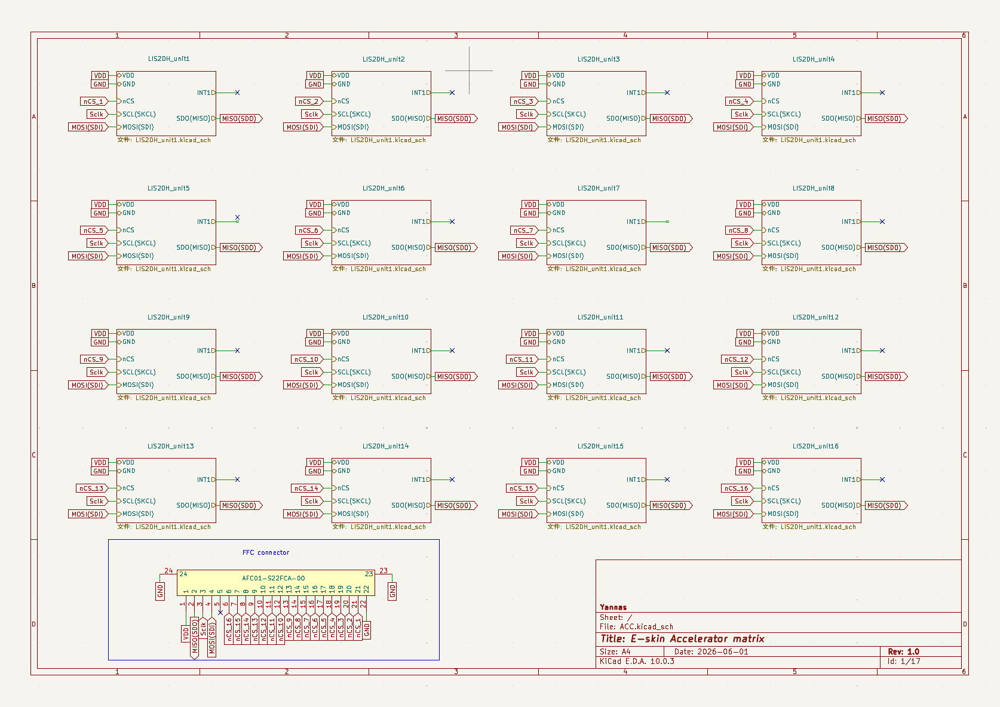
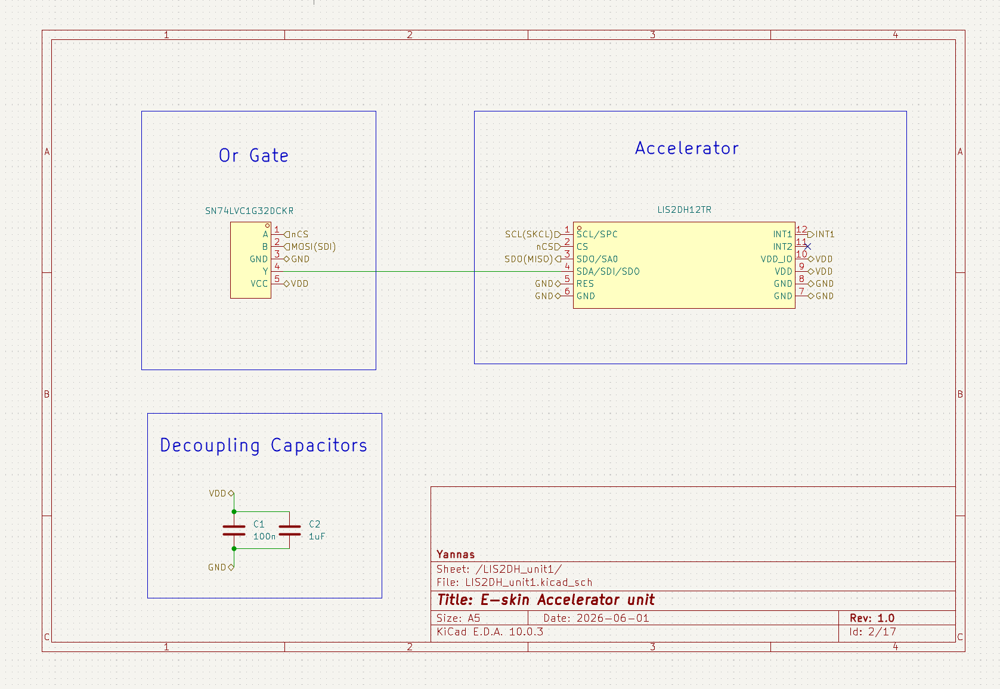

# ACC Layer Hardware

This folder documents the distributed accelerometer layer for one modular e-skin unit. The layer is designed as an array of small sensing islands connected through flexible traces so inertial information can be captured across the same physical module area as the pressure-sensing layer.

The current design focuses on scalable selection and shared-bus readout. Instead of assigning one independent SPI bus to every sensor, all accelerometers share communication lines while the mainboard selects one device at a time through decoded active-low chip-select signals.

## PCB Overview


The PCB arranges 16 accelerometer islands across the module surface. Each island carries an accelerometer footprint and local support components, with traces routed back toward the connector and selection interface. The island-style layout is intended to preserve mechanical compliance while still giving repeatable sensor placement.


The 3D render is used to check sensor placement, FPC connector orientation, component height, and the mechanical relationship between the ACC layer and the rest of the module stack.

## Complete Schematic



The overall schematic shows the shared communication bus, the sensor units, connector signals, decoded chip-select structure, and supporting logic. The layer is intended to connect to the mainboard through FPC interfaces so the module MCU can control sensor selection and readout.

## Sensor Unit



Each sensing island is built around a LIS2DH/LIS3DH-family accelerometer footprint and its local wiring. The unit exposes power, ground, SPI signals, chip select, and interrupt-capable outputs for future event-driven acquisition.

Key design points:

- Local accelerometer islands allow spatially distributed motion/vibration sensing.
- Shared bus lines reduce wiring complexity across the flexible layer.
- Active-low chip-select keeps only one accelerometer electrically active on the shared readout path.
- Interrupt pins are preserved for later event-driven strategies, such as waking the module MCU only when local motion exceeds a threshold.

## Selection and Readout Principle

The ACC layer is controlled by the module mainboard:

1. The STM32G474 on the mainboard places an address on the decoder control lines.
2. The decoder activates one accelerometer chip-select line by pulling it low.
3. The selected accelerometer listens on the shared bus.
4. The MCU sends register commands and clock pulses.
5. The selected accelerometer returns axis data on the shared MISO line.
6. The MCU releases chip select and moves to the next accelerometer when needed.

This structure keeps the ACC layer scalable: adding sensors mainly increases the decoded chip-select fanout instead of requiring a fully independent bus for every sensor.

## Design Intent

The ACC layer complements the FSR pressure layer. The FSR array captures contact pressure, while the ACC layer can capture vibration, impact, motion, and module-level dynamics. Together they support multimodal tactile sensing for robotic platforms and wearable rehabilitation interfaces.

The current ACC design is also intended to support future firmware experiments:

- Periodic full-array accelerometer scanning.
- Event-triggered readout from accelerometer interrupt pins.
- Local feature extraction on the module MCU.
- Patch-level synchronization across multiple modules.
- Higher-level encoding before data is sent to an FPGA or host controller.

## Folder Contents

```text
ACC/
|-- ACC.kicad_pro          KiCad project file
|-- ACC.kicad_sch          Main schematic
|-- ACC.kicad_pcb          PCB layout
|-- LIS2DH_unit1.kicad_sch Unit schematic variant
|-- LIS3DH_unit1.kicad_sch Unit schematic variant
|-- ACC.pretty/            Local footprint library
|-- symbols/               Local symbol library
|-- 3D model/              STEP models
`-- docs/
    |-- Graphs/            PCB, render, and schematic images
    `-- Datasheet/         Component datasheets
```

## Development Notes

This layer is still under active development. The current files document the sensing-island layout, shared-bus architecture, connector concept, and first visual documentation set. Further work will refine routing, stack-up integration, flex constraints, connector placement, and manufacturing checks.
