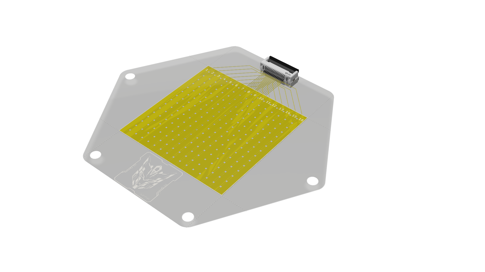

# FSR Array Hardware

This folder documents the flexible pressure-sensing layer for one modular e-skin unit. The FSR layer is designed as a folded `16 x 16` tactile matrix that connects to the mainboard scanning electronics through a compact FPC interface.

The design goal is to create a thin, repeatable, module-sized pressure sensor layer that can be aligned with the mainboard and ACC layer while preserving a scalable row-column readout strategy.

## PCB Overview


The PCB layout contains two mirrored electrode halves. After folding, the two electrode layers face each other with pressure-sensitive resistive material between them. This forms row-column intersections whose resistance changes when pressure is applied.



The render is used to review the folded geometry, connector tail placement, mounting features, and mechanical fit with the rest of the module.

## Schematic


The schematic represents the row and column electrode connections that leave the flexible array through the FPC tail. The layer itself stays passive: scanning and conversion are handled by the mainboard MUX and ADC circuits.

## Working Principle

The FSR layer behaves as a pressure-dependent resistance matrix:

1. The mainboard MUX drives one row at a time.
2. Pressure at a row-column intersection changes the local FSR resistance.
3. Each selected intersection forms a voltage divider with the column-side load resistor on the mainboard.
4. The MAX11633 ADC samples the column voltages.
5. The STM32G474 reconstructs the pressure map from scanned row and column values.

This keeps the sensor layer thin and mechanically simple while placing active electronics on the mainboard, where routing, power, firmware, and debugging are easier to manage.

## Folded Layer Design

The array is designed around a folded structure rather than a rigid two-board stack:

- The two electrode halves are axis-symmetric around the fold line.
- Folding brings row and column electrodes into alignment.
- A pressure-sensitive resistive film or layer sits between the two electrode planes.
- A `40 mm x 40 mm` active region targets a compact module-scale sensing area.
- Mounting/alignment holes help keep the layer repeatable during assembly.
- A standalone `AFC01-S16FCA-00` FPC tail footprint provides a compact interface to the mainboard.

## Relationship to Mainboard Readout

The FSR layer intentionally remains passive. The mainboard provides:

- Row selection through `CD74HC4067` analog multiplexers.
- Column voltage readout through MAX11633-family ADCs.
- Load resistors for voltage-divider measurement.
- Firmware-controlled scan timing, data packaging, and future local encoding.

This separation makes the FSR layer easier to fabricate and replace while allowing the electronics layer to evolve independently.

## Folder Contents

```text
FSR-array/
|-- FSR-array.kicad_pro         KiCad project file
|-- FSR-array.kicad_sch         Main schematic
|-- FSR-array.kicad_pcb         Folded array PCB layout
|-- FSR-array.pretty/           Local footprint library
|-- seperate/                   Separated-layer KiCad files
|-- 3D models/                  STEP exports
`-- docs/
    `-- Graph/                  PCB, render, and schematic images
```

## Development Notes

This FSR layer is still under active development. The current design documents the foldable geometry, electrode layout, active sensing area, connector-tail concept, separated-layer files, and initial visual documentation. Next steps include material selection, stack-up validation, manufacturing review, calibration, and integration testing with the STM32G474 mainboard and programmable simulator.
