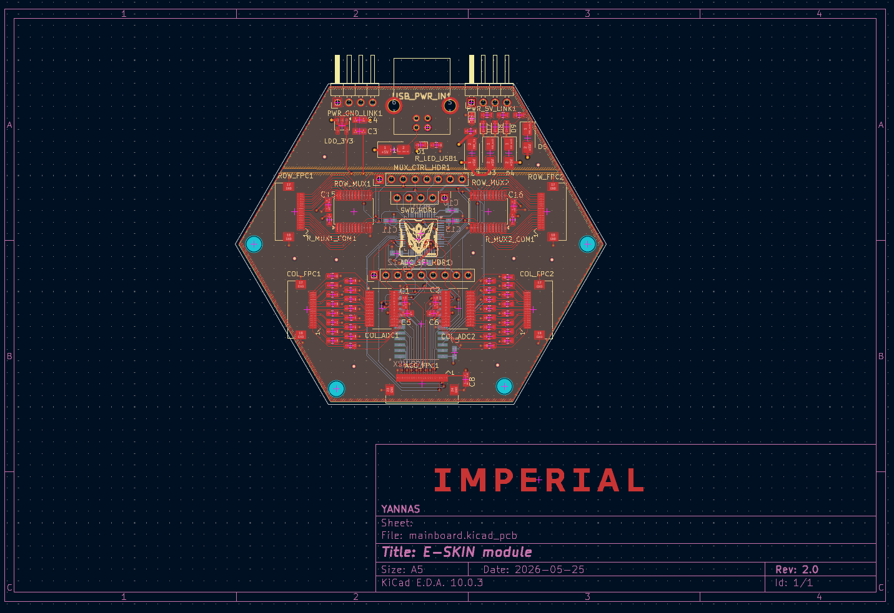
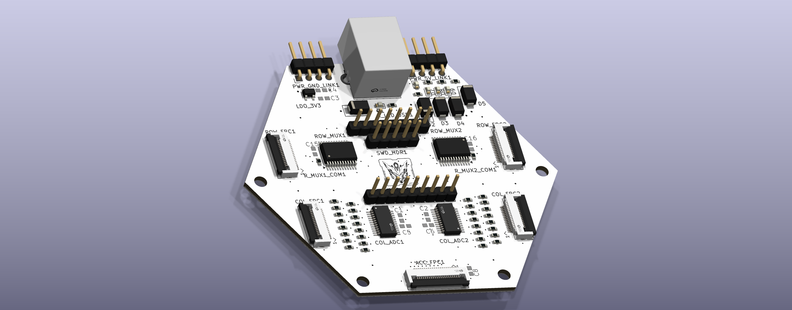
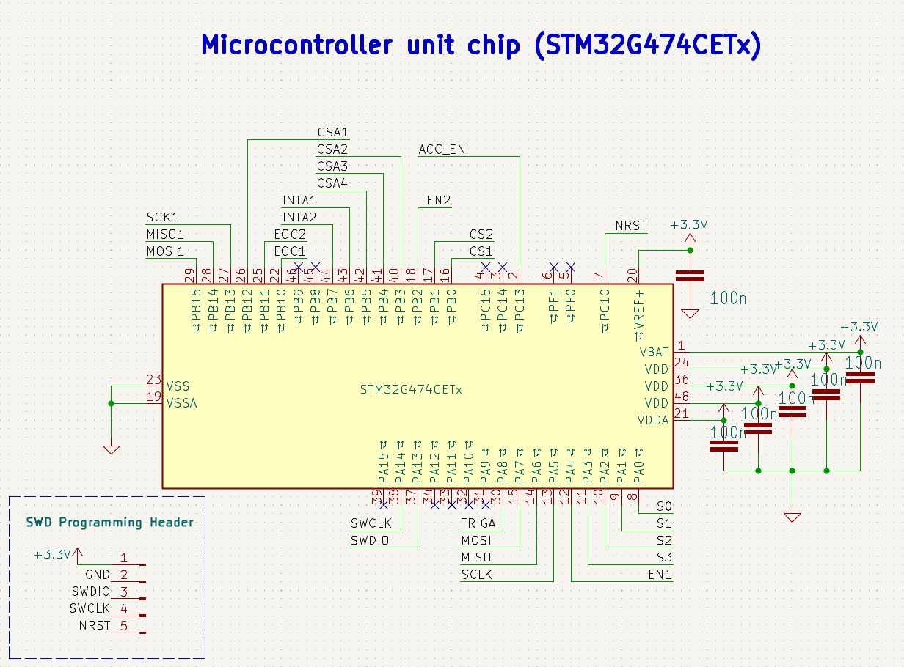
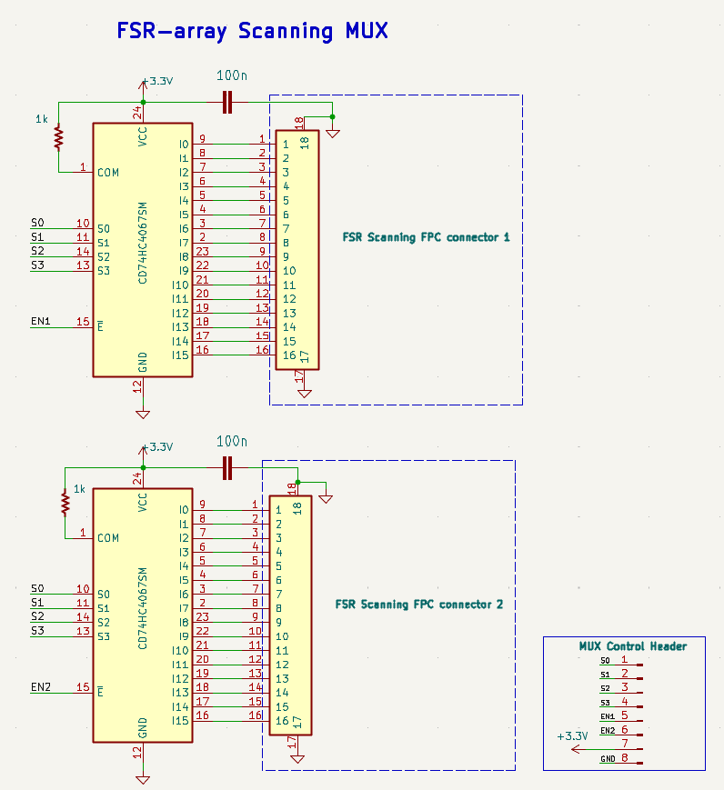
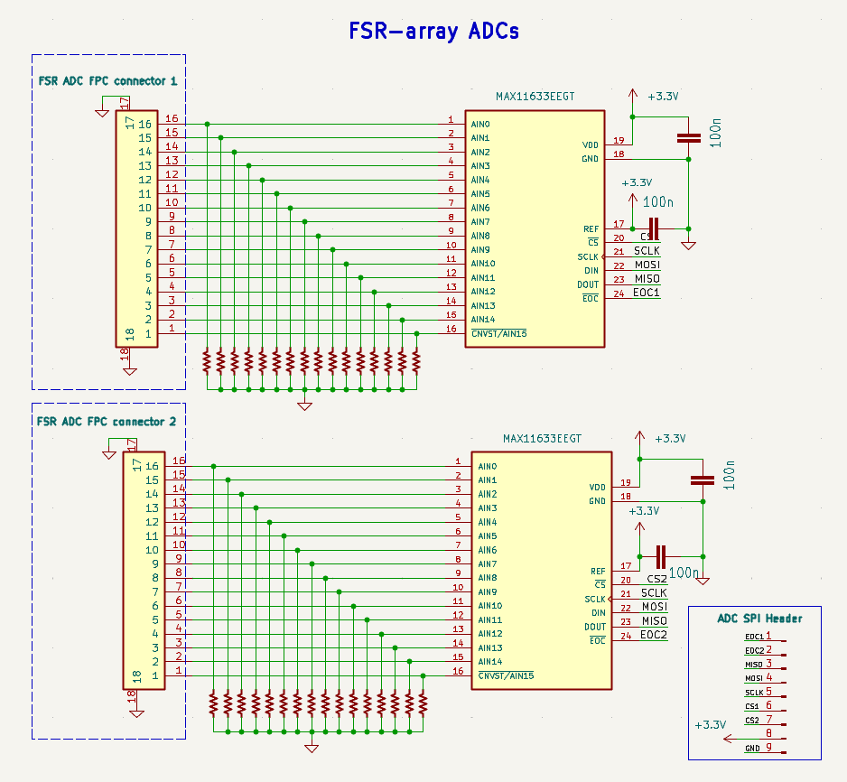
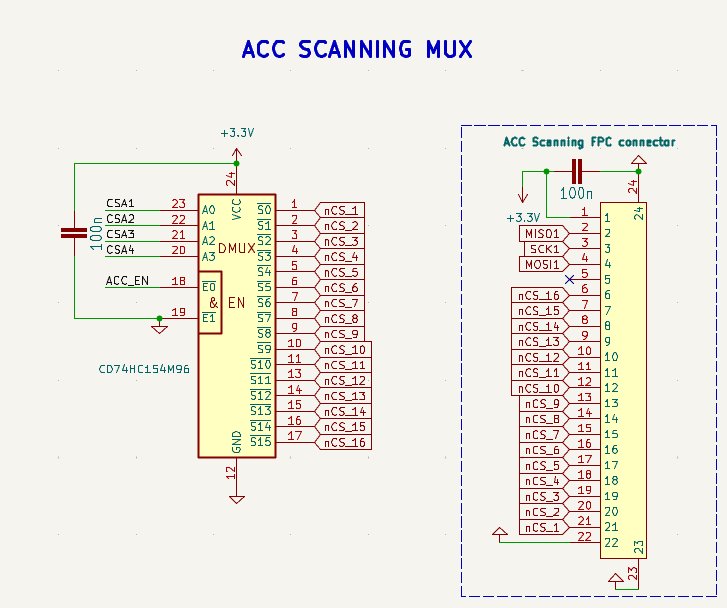
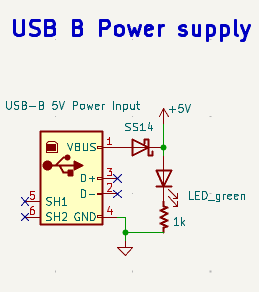
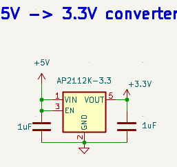
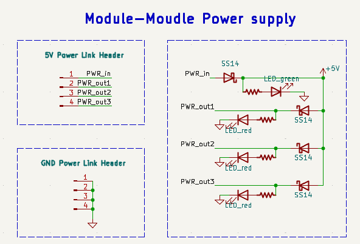

# E-Skin Mainboard 2.0 Hardware

This repository branch documents the current mainboard hardware prototype for a modular multi-layer e-skin module. The board is designed around a local STM32G474 MCU that scans the FSR layer, reads the ADC channels, communicates with the accelerometer layer, and prepares the module for later patch-level aggregation.

The hardware is still under active development. This snapshot records the first complete PCB layout and routing pass for the current architecture.

## PCB Overview

The PCB places the local MCU near the center of the module and distributes the row-scanning, column-readout, accelerometer, programming, and power interfaces around it. The layout is intended to support a compact module form factor while keeping the FSR row-driving and ADC column-reading paths organized.

The rendered view provides a quick mechanical check of the connector positions, IC placement, and board-level symmetry. It is useful for reviewing assembly access, cable direction, and whether the module can be integrated into a larger patch structure.

## Complete Schematic

GitHub README files cannot reliably embed PDF pages directly, so the complete schematic is shown below as an SVG vector export. The original PDF vector version is linked for download and printing.

Vector PDF version: [docs/Graph/schematic/mainboard.pdf](docs/Graph/schematic/mainboard.pdf).

## Functional Blocks

### MCU Control Core

The main controller is an STM32G474-series MCU. It replaces the earlier Teensy-based prototype and acts as the local controller for one e-skin module. Its responsibilities include row-scan control, ADC command generation, ADC data readout, accelerometer-layer selection, event handling, and future local encoding or compression algorithms.

The MCU also exposes an SWD programming/debug interface so firmware can be loaded and inspected directly during bring-up.

### FSR Row Scanning MUX

The FSR row side is driven through CD74HC4067 analog multiplexers. The MCU controls the selected row using the shared address lines `S0-S3` and enable lines. During scanning, only the selected row is actively driven, while the ADC side observes the corresponding column voltages.

This keeps the number of MCU pins low while allowing the module to address a 16-row sensing structure.

### FSR Column ADC Readout

The column side is measured through MAX11633-family ADC devices. Each column input is paired with a 10 kOhm fixed resistor to form a voltage divider with the external FSR element. When pressure changes the FSR resistance, the column voltage changes and is converted into digital data by the ADC.

The MCU communicates with the ADCs over SPI-style control and readout lines, including chip-select, clock, MOSI command input, MISO conversion output, and end-of-conversion signalling.

### Accelerometer Layer Selection

The accelerometer layer is connected through a dedicated FPC interface. A CD74HC154 decoder expands MCU control lines into multiple active-low chip-select signals, allowing the MCU to select individual accelerometer devices on the shared bus.

This structure supports scalable inertial sensing without assigning a separate MCU chip-select pin to every accelerometer.

### USB Power Input and Power Conversion

The USB-B connector is currently used as a 5 V power input. It is not intended as the primary STM32 programming interface in this revision; programming is handled through SWD. The board then generates a local 3.3 V rail using an AP2112K-3.3 regulator. The 3.3 V rail powers the MCU and low-voltage digital/signal-processing components. Local decoupling capacitors are placed around the regulator and IC supply pins to reduce supply noise.

### Module-to-Module Power Link

The module includes simple power-link headers for sharing 5 V and ground across modules in a patch. This allows one module or one patch-level entry point to distribute power to neighbouring modules, while data communication can remain separately defined.

## Current Working Principle

1. The board receives 5 V power and generates 3.3 V locally.
2. The STM32G474 selects one FSR row through the row-scanning MUX.
3. Pressure on the FSR layer changes the resistance at the selected row-column intersections.
4. Column divider voltages are sampled by the MAX11633 ADCs.
5. The ADC conversion results are returned to the MCU.
6. The MCU can package the scan result, apply future local strategies such as event-driven sensing or compression, and forward data to a higher-level controller.
7. The MCU can also select and communicate with accelerometer devices through the ACC FPC and decoder block.

## Development Notes

- The PCB has completed a first full layout and routing pass.
- The design should still be checked through ERC, DRC, footprint orientation review, FPC pin-order verification, and power integrity review before fabrication.
- Future revisions may refine the module-to-module communication interface, FPGA/host integration, and local firmware protocol.
