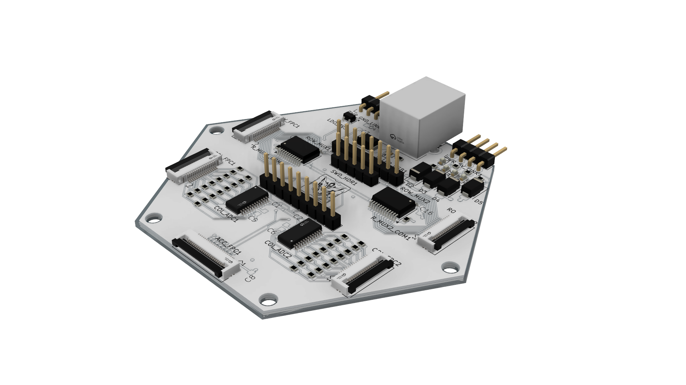
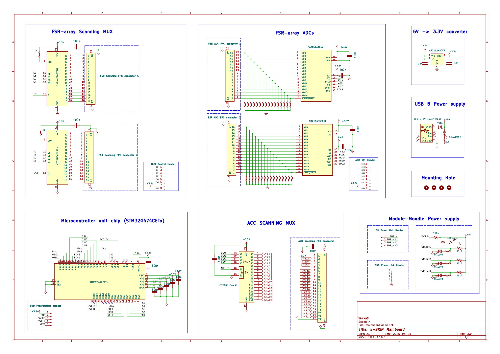

# Modular Multi-Layer Electronic Skin Hardware

This branch documents the current hardware design for a modular multi-layer electronic-skin platform for robotic tactile sensing and feedback. Each module combines a local STM32G474-based mainboard, a distributed accelerometer layer, and a flexible FSR pressure-sensing layer. The system is designed around a hierarchical **host - patch - module** architecture, where each module can locally scan, synchronize, package, and later encode sensor data before forwarding it to a higher-level controller or FPGA.

The hardware remains under active development. This branch is organized as a hardware-first repository view: the active design folders are placed directly at the repository root, while the change history is kept under [docs/CHANGELOG.md](docs/CHANGELOG.md).

## Module Overview


The current module stack contains three main hardware layers:

1. **Mainboard:** local STM32G474 control, power conversion, FSR row scanning, ADC readout, ACC-layer selection, and external host/patch communication.
2. **ACC layer:** a distributed accelerometer array with 16 sensor islands connected through flexible traces and selected through a shared bus plus decoded chip-select lines.
3. **FSR array:** a folded flexible pressure-sensing structure with orthogonal row and column electrodes for a `16 x 16` tactile matrix.

## Multi-Module Concept


The five-module render shows the intended patch-level deployment. The module geometry supports repeatable tiling while keeping each unit independently serviceable. This supports future experiments in synchronized multi-module sensing, local data aggregation, event-driven acquisition, and VAE-based tactile encoding.

## Hardware Folders

| Layer | Folder | Preview |
| --- | --- | --- |
| Mainboard | [mainbord/2.0](mainbord/2.0) |  |
| ACC layer | [ACC](ACC) |  |
| FSR array | [FSR-array](FSR-array) |  |

### Mainboard

The mainboard is the local control layer for one e-skin module. It uses an `STM32G474CETx` MCU to coordinate pressure scanning, ADC command/readout, accelerometer selection, local power management, and future module-level data processing.

Key blocks:

- `STM32G474CETx` local module MCU.
- `CD74HC4067` row-scanning MUX blocks for the FSR layer.
- `MAX11633` ADC readout for FSR column divider voltages.
- `CD74HC154` decoder for accelerometer chip-select expansion.
- `AP2112K-3.3` local 3.3 V regulation from a 5 V input.
- SWD programming/debug interface and module-to-module power headers.

Full documentation: [mainbord/2.0/README.md](mainbord/2.0/README.md)



### ACC Layer

The accelerometer layer distributes 16 inertial sensing islands across the module surface. The design uses shared SPI-style communication lines and individually decoded active-low chip-select signals so the mainboard MCU can select and read one accelerometer at a time without dedicating one MCU pin per sensor.

Full documentation: [ACC/README.md](ACC/README.md)


### FSR Array

The FSR layer is a flexible folded pressure-sensing array. Two mirrored electrode halves are folded together with pressure-sensitive resistive material between them, forming a compact `16 x 16` pressure matrix that can be scanned by the mainboard MUX and ADC circuits.

Full documentation: [FSR-array/README.md](FSR-array/README.md)


## Module Operation

1. The module receives `5 V` power and generates a local `3.3 V` rail.
2. The STM32G474 selects one FSR row through the row-scanning MUX.
3. Pressure on the FSR layer changes the row-column intersection resistance.
4. Column divider voltages are converted by the MAX11633 ADC.
5. ADC conversion results are returned to the MCU.
6. The MCU selects ACC devices through the decoder and reads inertial data over the shared bus.
7. Local firmware can filter, compress, encode, or selectively transmit sensor data to a patch-level controller or FPGA.

## Repository Structure

```text
.
|-- ACC/              Distributed accelerometer layer
|-- FSR-array/        Folded flexible pressure-sensing array
|-- mainbord/
|   |-- 1.0/          Earlier mainboard revision
|   |-- 1.1/          Earlier mainboard revision
|   `-- 2.0/          Current mainboard hardware revision
|-- docs/
|   |-- CHANGELOG.md  Hardware branch history
|   |-- DEMO.png      Multi-module patch concept render
|   `-- Rendering.png Complete module render
`-- README.md         Hardware overview
```

## Development Status

- The mainboard 2.0 schematic, PCB layout, routing pass, documentation assets, and mechanical render are available.
- The ACC-layer PCB architecture, sensing islands, shared-bus selection concept, connector structure, and visual documentation are available.
- The folded FSR-array geometry, symmetric electrode layout, active sensing area, FPC mating tail, separated-layer files, and visual documentation are available.
- Upcoming work will focus on manufacturing-rule review, stack-up integration, calibration, firmware bring-up, and validation with the programmable simulator.
