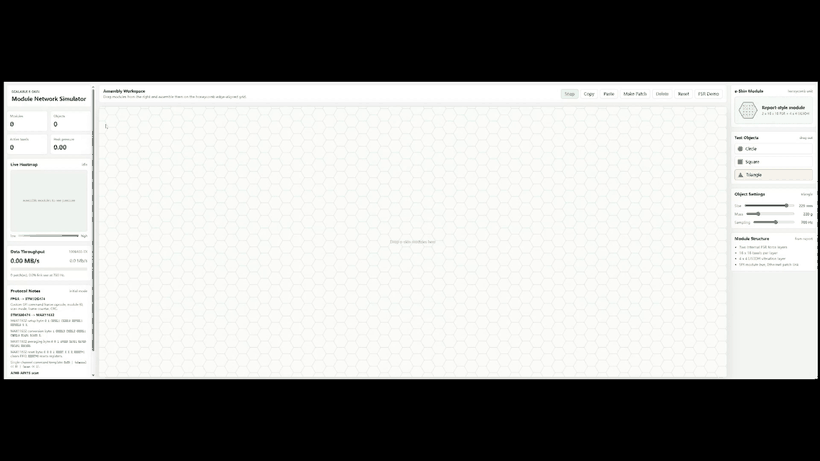
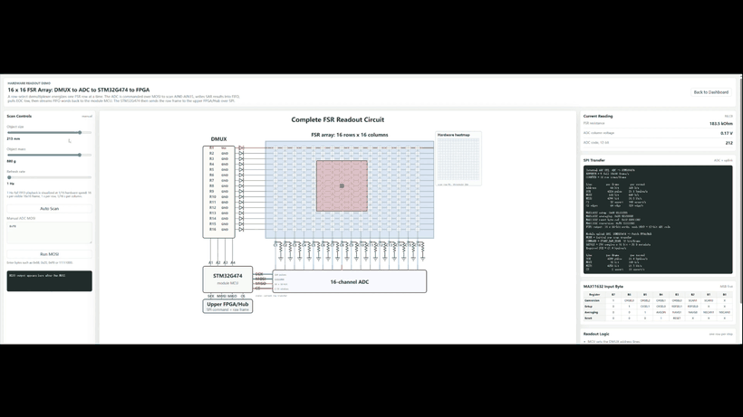
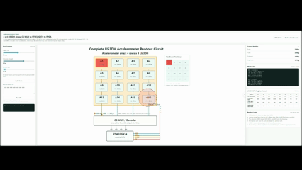

# Modular e-Skin Network Simulator

This project is a lightweight software simulator for exploring scalable electronics in a modular, multi-layer electronic skin system. It is based on the planning work in `E_skin_plan_report.pdf`, which studies how an existing multi-modal e-skin platform can be redesigned into a compact, modular architecture with better data, power, and calibration scalability.

## Background

The simulated e-skin module follows the hardware structure described in the report:

- Hexagonal honeycomb-style module geometry
- Two internal `16 x 16` FSR force-sensing layers
- One `4 x 4` LIS3DH accelerometer layer
- Module-level sensing with patch-level aggregation
- Data throughput estimated from `560 channels/module` at a configurable sampling rate

The simulator is intended as an early design and communication tool rather than a high-fidelity finite-element or electronics model.

## Hardware Module Preview

The simulator is developed alongside a modular hardware prototype. Each hexagonal module is designed as a compact stack containing a local mainboard, a distributed accelerometer layer, and a folded FSR pressure-sensing array.


The same geometry supports patch-level assembly. The render below shows a five-module configuration that motivates the simulator's honeycomb workspace, patch grouping, and scalable data-throughput tools.


The complete PCB layouts, schematics, layer renders, and hardware development notes are maintained on the [`codex/hardware-prototype` branch](https://github.com/Yannas-Sun/e-skin-simulator/tree/codex/hardware-prototype).

## Development Status

This project is still under active development. The current repository captures the first programmable simulation workflow, hardware-readout demo, and visualization interface. New functions will continue to be added, including richer scan strategies, external MCU-in-the-loop testing, event-driven sensing experiments, encoder/VAE-style data compression, and more complete multi-patch communication models.

## Features

### Module Network Dashboard

- Drag hexagonal e-skin modules into a honeycomb grid
- Assemble modules into arbitrary edge-aligned networks
- Box-select multiple modules or test objects
- Move, copy, paste, and delete selected items
- Combine selected modules into a patch
- Click a patch label or outline to focus the workspace view on that patch
- Show heatmap and throughput data for the focused patch until another item is selected
- Drag test objects onto the module network
- Choose object shape: circle, square, or triangle
- Adjust object size and mass
- Zoom the workspace using the mouse wheel, centered on the cursor
- Display a live pressure heatmap matching the assembled module topology
- Show module IDs on the heatmap
- Estimate real-time data throughput and Ethernet link use

### Programmable FSR Readout Demo

- Open an FSR readout demo showing DMUX row selection, 16 x 16 FSR voltage-divider readout, 16-channel ADC sampling, and four-wire SPI transfer back to the MCU
- Run the FSR demo from programmable Python virtual hardware classes rather than frontend-only formulas
- Simulate a MAX11632-style ADC command flow, including setup, averaging, reset, conversion input bytes, FIFO readout, EOC behavior, and 16-bit MISO output words
- Enter custom MOSI byte sequences from the web UI and inspect the resulting MISO FIFO output
- Generate the FSR heatmap from scanned ADC/FIFO data rather than directly from object placement
- Switch visualization behavior by refresh rate while keeping the same scan pipeline: MUX row scan followed by ADC FIFO column output
- Use the simulator as a bridge toward physical MCU testing, where an external MCU can later drive or validate the same command and data-transfer logic

### Programmable LIS3DH Accelerometer Demo

- Open an accelerometer demo showing a 4 x 4 LIS3DH array with shared SPI and individual chip-select control through a MUX
- Simulate LIS3DH SPI command encoding: `R/W`, multi-byte auto-increment, and 6-bit register address
- Read `OUT_X_L` through `OUT_Z_H` using the datasheet-style `0xE8` command byte
- Adjust the virtual object's vibration strength and footprint
- Decode X/Y/Z acceleration only from returned MISO register bytes
- Generate the hardware heatmap from decoded MISO data rather than direct object placement
- Display counted SPI traffic for address lines, SCK, MOSI, MISO, CS, and the upstream MCU-to-FPGA frame
- Solve the active-low LIS3DH chip-select electrical layer through ngspice when the solver is available

### Physical Hardware Console

- Read continuous FSR and accelerometer frames directly from a Teensy 4.1 serial port
- Keep backend acquisition independent from the fixed-rate browser visualization
- Tare both FSR layers and display flexible 2D heatmaps, smooth 3D surfaces, and a combined interactive view
- Report measured hardware FPS, payload size, and Teensy-to-PC serial throughput
- Compile and upload full-frame, delta, triggered, or FSR-only firmware from one dedicated page
- Keep physical COM-port behavior separate from the software-only FSR and ACC demos

## Demo Videos

The repository includes embedded demo previews to document the current simulator behavior. The original MP4 recordings are kept in `docs/demo/`, while the GIF previews below are used because GitHub README pages do not render repository-hosted MP4 files as inline players.

### Programmable FSR Readout Demo

Demonstrates the programmable FSR readout page, including MUX-controlled row scanning, ADC/FIFO-based column readout, MOSI command input, MISO output inspection, and hardware-derived heatmap generation.



### Module Network Dashboard

Demonstrates the modular e-skin dashboard, including honeycomb-style module placement, object interaction, patch-oriented pressure visualization, module identifiers, and data-throughput feedback.



### Physical Hardware Console

Demonstrates the current Teensy readout workflow, including two live FSR layers, hardware-rate metrics, serial throughput, tare, and firmware upload controls.



These videos show the current state of the prototype. The simulator remains in progress, and future videos will be updated as new hardware models, external MCU workflows, scan strategies, and algorithm experiments are added.

## Running

The simulation APIs use the Python standard library. Install `pyserial` for the physical hardware console:

```powershell
python -m pip install -r requirements.txt
```

```powershell
python server.py
```

Then open:

```text
http://127.0.0.1:8000
```

Use the HTTP address above rather than opening `index.html` directly, because the frontend calls the Python backend API at `/api/simulate`.

## ngspice Electrical Backend

The project includes an optional ngspice adapter for circuit-level simulation. A local Windows runtime can be placed under the ignored `tools/ngspice/` directory, or supplied through the environment or `PATH`.

The backend discovers ngspice in this order:

1. `NGSPICE_EXECUTABLE`
2. `tools/ngspice/Spice64/bin/ngspice_con.exe`
3. `ngspice_con` or `ngspice` on `PATH`

The health endpoint runs a `3.3 V` FSR voltage-divider smoke test through ngspice:

```text
http://127.0.0.1:8000/api/ngspice-health
```

The manual ADC workflow can use ngspice for the selected-row electrical network. The continuous FSR animation uses the faster Python divider model. In both cases, the MAX11632 model converts column-node voltages into FIFO and MISO words.

The accelerometer demo uses ngspice for the LIS3DH active-low chip-select electrical layer. The address decoder network is solved as 16 nCS lines with pull-ups, LIS3DH input leakage, and one selected decoder sink. Python then continues with the digital LIS3DH register/SPI behavior. The dashboard-level module heatmap still uses the fast Python pressure model.

## Fusion 3D Model Preview

The dashboard includes a load-on-demand Fusion OBJ preview for the module model. The large `Module.obj` asset is tracked with Git LFS through `.gitattributes`, while the viewer uses a small vendored Three.js subset so the preview works without a CDN.

## Basic Usage

1. Drag an `e-Skin Module` from the right panel into the workspace.
2. Arrange modules on the honeycomb grid.
3. Drag a test object into the workspace.
4. Adjust object size, mass, and sampling rate from the right panel.
5. Read the pressure heatmap and data throughput from the left panel.
6. Drag on empty workspace space to box-select multiple items.
7. Use toolbar buttons or shortcuts:
   - `Copy`
   - `Paste`
   - `Delete`
   - `Ctrl+C`
   - `Ctrl+V`
   - `Delete` / `Backspace`
8. Click `FSR Demo` to inspect the hardware readout path for one 16 x 16 FSR layer.
9. Click `Accel Demo` to inspect the LIS3DH accelerometer-array readout path.
10. Open `Hardware Live` for COM-port acquisition, tare, hardware metrics, and firmware upload.

## Project Structure

```text
software-simulation/
  server.py                    # stable root launcher
  requirements.txt            # real-hardware serial dependency
  backend/
    server.py                  # HTTP routes, serial sessions, and firmware upload
    dashboard.py               # module pressure and throughput calculations
    fsr/                       # DMUX, FSR, MAX11632, SPI, and scan program
    accel/                     # LIS3DH, CS decoder, SPI, and scan program
    electrical/                # optional ngspice adapter
  circuits/
    ngspice/                   # standalone reference SPICE decks
  firmware/
    teensy41/                  # tracked FSR-only and combined Teensy sketches
  frontend/
    index.html                 # module-network dashboard
    fsr-demo.html              # virtual FSR readout demo
    accelerometer-demo.html    # virtual LIS3DH readout demo
    hardware-live.html         # physical Teensy console and uploader
    css/app.css                # shared responsive styles
    js/
      pages/                   # one controller per HTML page
      components/              # optional reusable viewers
    assets/models/             # Fusion OBJ/MTL module preview
    vendor/three/              # vendored Three.js subset
  docs/
    PROJECT_STRUCTURE.md       # dependency and source-of-truth map
    datasheets/                # component references
    demo/                      # MP4 sources and GitHub GIF previews
    hardware/                  # README hardware images
    references/                # reports and publications
  tools/
    acquisition/               # optional offline serial/MATLAB tools
    arduino-cli/               # local CLI slot; executable remains ignored
  CHANGELOG.md                 # ordered change record
```

See [`docs/PROJECT_STRUCTURE.md`](docs/PROJECT_STRUCTURE.md) for the page-to-API map, firmware source paths, generated directories, and source-of-truth rules. Uploadable Teensy source is tracked under `firmware/`; local KiCad prototypes and downloaded binary utilities remain excluded.
