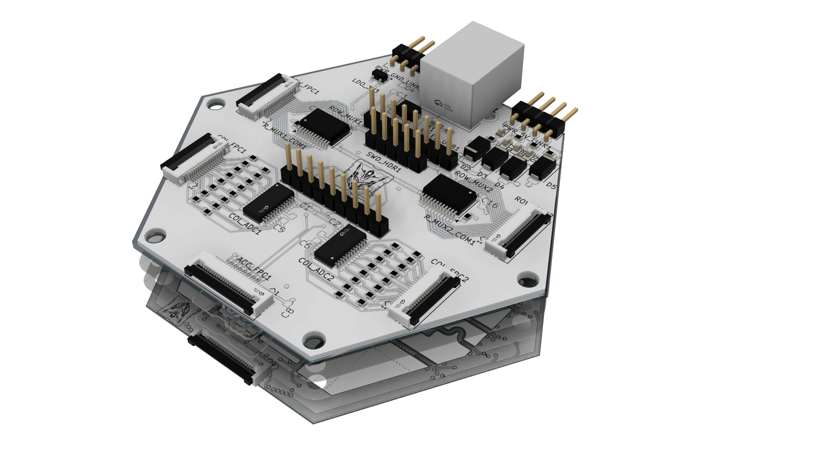
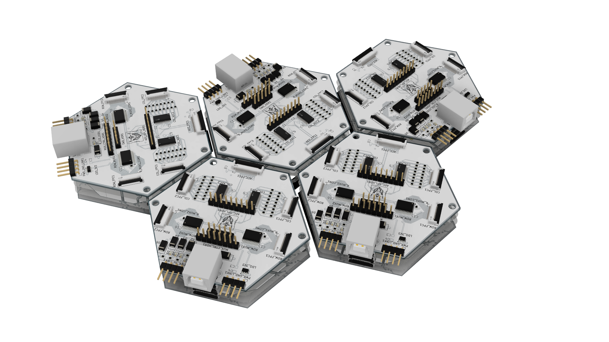
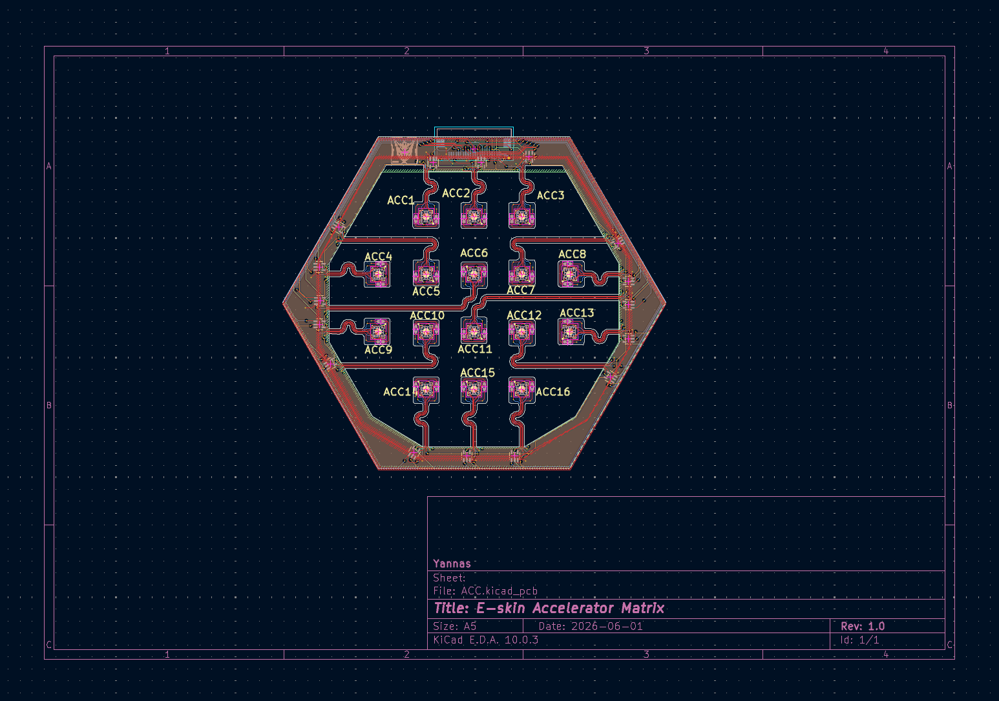
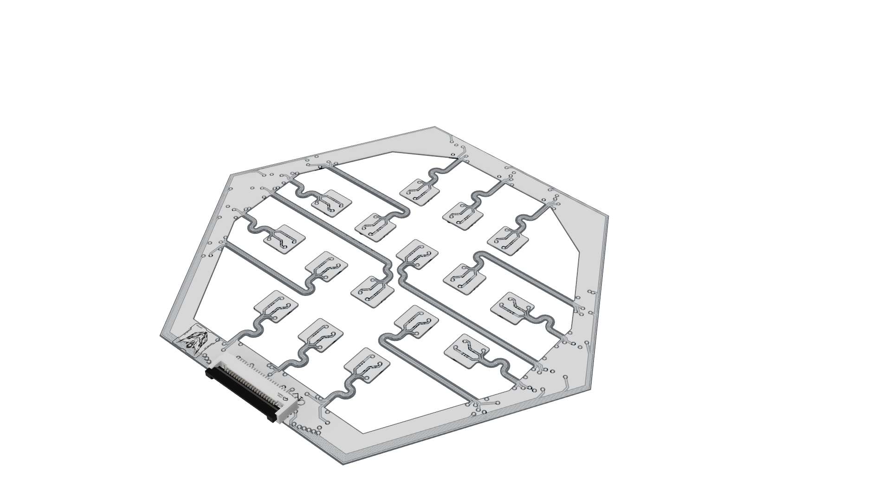
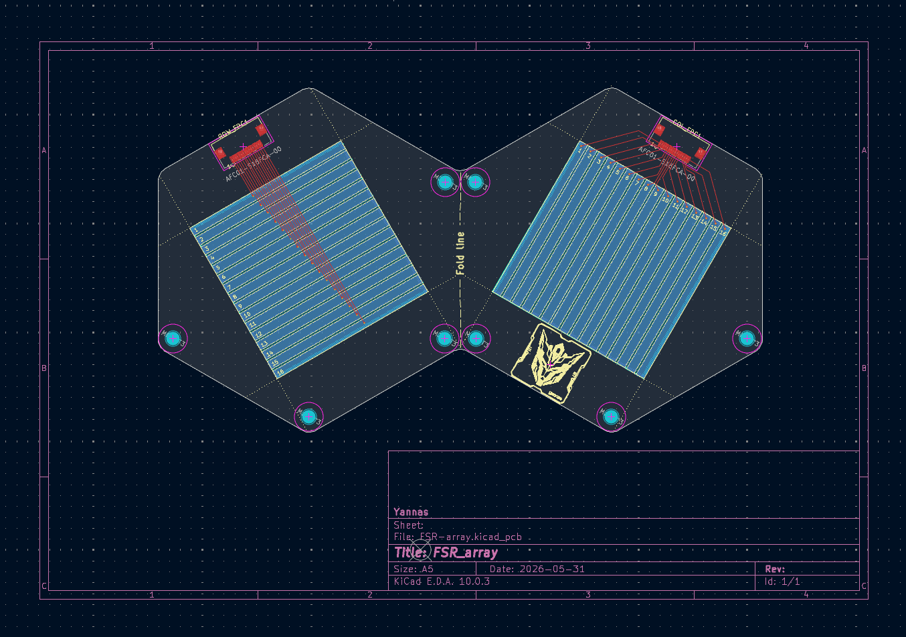
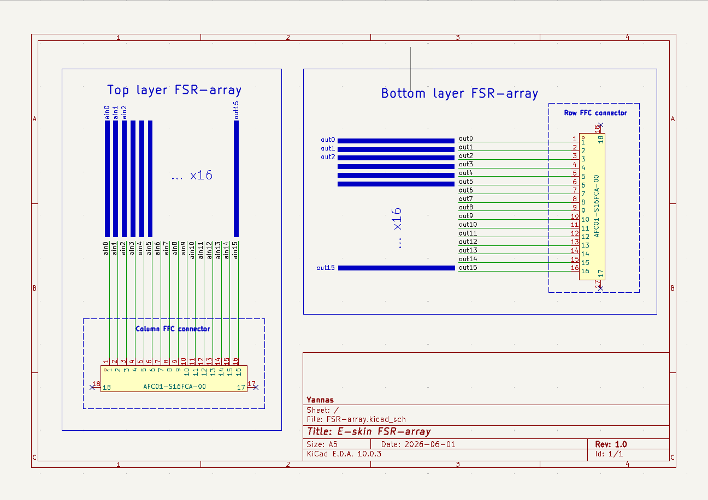

# Modular Multi-Layer Electronic Skin

This repository documents an in-progress modular electronic-skin platform for robotic tactile sensing and feedback. Each hexagonal module combines a local control board, a distributed accelerometer layer, and a pressure-sensitive FSR array. Multiple modules can be assembled into a larger patch while preserving a repeatable mechanical and electrical interface.

The current hardware iteration is designed around a hierarchical **host - patch - module** architecture. Each module contains its own STM32G474 MCU so that scanning, synchronization, data packaging, and future local encoding strategies can be developed close to the sensors before data is forwarded to a higher-level controller or FPGA.

## Module Overview



The module is built as a compact stack:

1. **Mainboard:** local STM32G474 control, power conversion, FSR scanning interfaces, ADC readout, and ACC-layer selection.
2. **ACC layer:** a distributed accelerometer layer with 16 sensing islands connected through flexible traces.
3. **FSR array:** a folded flexible pressure-sensing structure with orthogonal electrode layers and a connector tail.

## Multi-Module Demo



The five-module render demonstrates the intended patch-level deployment. The hexagonal geometry supports repeatable tiling while each module remains independently serviceable. This structure is intended to scale toward synchronized multi-module sensing, local data aggregation, event-driven acquisition, and future VAE-based encoding experiments.

## Hardware Layers

### 1. Mainboard

| PCB layout | 3D render |
| --- | --- |
|  |  |

The mainboard is the local control layer for one e-skin module. It is built around an `STM32G474CETx` MCU and provides:

- FSR row selection through `CD74HC4067` analog multiplexers.
- FSR column readout through `MAX11633` ADCs and fixed voltage-divider resistors.
- ACC-layer device selection through a `CD74HC154` decoder.
- Local `5 V` to `3.3 V` regulation using `AP2112K-3.3`.
- SWD programming and debugging.
- Module-to-module power distribution headers.

The complete schematic, functional-block diagrams, PCB files, STEP model, component footprints, and datasheets are documented in [prototype/new/mainbord/2.0](prototype/new/mainbord/2.0).


### 2. ACC Layer

| PCB layout | 3D render |
| --- | --- |
|  |  |

The accelerometer layer distributes 16 sensing islands across the module surface. Each island contains a `LIS2DH12TR` accelerometer and local passive components. Flexible traces connect the islands to the surrounding structure so that the sensing surface can preserve mechanical compliance.

The ACC layer is designed around:

- Shared SPI communication lines.
- Individual active-low chip-select control from the mainboard decoder.
- Interrupt outputs for future event-driven sensing strategies.
- FPC interfaces for integration with the mainboard.
- A flexible island layout intended to support tactile and motion experiments.

The ACC schematic, unit schematic, PCB layout, custom footprints, component models, renders, and datasheets are available in [prototype/new/ACC](prototype/new/ACC).


### 3. FSR Array

| PCB layout | 3D render |
| --- | --- |
|  |  |

The FSR layer is a flexible pressure-sensing array. It is designed as a folded structure with two electrode halves. After folding, a pressure-sensitive resistive film can be placed between the orthogonal electrode layers to form a `16 x 16` sensing matrix.

The current FSR-array design includes:

- Two axis-symmetric flexible halves aligned around the fold line.
- A `40 mm x 40 mm` active sensing region.
- `16` row electrodes and `16` column electrodes.
- Mounting holes for repeatable mechanical alignment.
- A standalone `AFC01-S16FCA-00` FPC mating tail footprint with `0.50 mm` pitch, `16` exposed fingers, and a marked stiffener region.

The FSR schematic, PCB files, separated-layer files, local footprint library, renders, and STEP models are available in [prototype/new/FSR-array](prototype/new/FSR-array).



## Module Operation

1. The mainboard receives `5 V` and generates the local `3.3 V` rail.
2. The STM32G474 selects one FSR row through the scanning MUX.
3. Applied pressure changes the resistance at the FSR row-column intersections.
4. Column divider voltages are sampled by the MAX11633 ADCs.
5. ADC conversion results are returned to the module MCU.
6. The MCU selects and reads ACC-layer devices over the shared bus.
7. Local firmware can package, filter, compress, or selectively transmit sensor data to a higher-level controller.

## Repository Structure

```text
prototype/new/
|-- mainbord/2.0/   Current mainboard hardware revision
|-- ACC/            Distributed accelerometer layer
|-- FSR-array/      Folded flexible pressure-sensing array
`-- docs/           Complete module and multi-module renders
```

Earlier mainboard revisions are preserved under `prototype/new/mainbord/1.0` and `prototype/new/mainbord/1.1` for reference.

## Development Status

This hardware platform remains under active development.

- The first complete mainboard schematic, PCB layout, routing pass, documentation set, and mechanical render have been completed.
- The ACC-layer PCB architecture, sensing islands, flexible routing concept, and connector structure have been drafted.
- The folded FSR-array geometry, symmetric electrode layout, active sensing area, and FPC mating-tail concept have been drafted.
- The next stage is detailed layer integration, manufacturing-rule review, prototype fabrication, calibration, and validation with the programmable simulator.

Future iterations will continue to refine the flexible-layer stack-up, connector placement, pressure-sensitive material interface, module-to-module power distribution, external controller protocol, and embedded sensing strategies.

