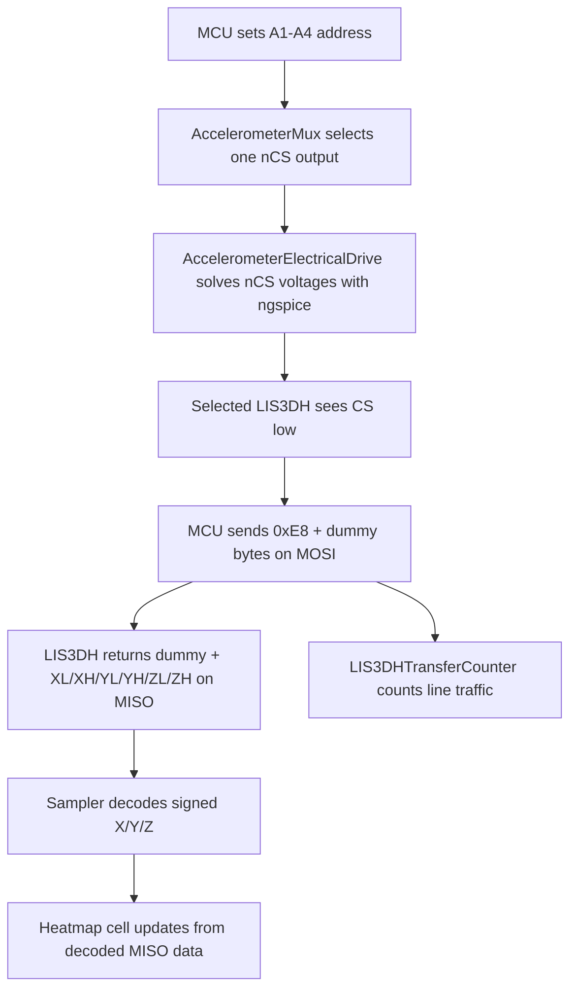

# LIS3DH Accelerometer Hardware Model Classes

This document explains the structure of `backend/accel/hardware.py`. The file models the hardware-facing layer of the accelerometer readout demo: LIS3DH register behavior, shared SPI transfers, active-low chip-select decoding, ngspice electrical nCS solving, vibration-to-sample generation, and data-rate accounting.

The sampler in `backend/accel/sampler.py` acts like the STM32G474 scan program. The classes below act like the virtual hardware blocks that the sampler drives.

```text
AccelerometerReadoutProgram
    -> AccelerometerMux
        -> AccelerometerElectricalDrive
            -> NgSpiceBackend
    -> AccelerometerArray
        -> LIS3DH
    -> LIS3DHTransferCounter
    -> ModuleUplinkSPI
```

## Hardware Boundary

The real accelerometer layer is digital after each LIS3DH has sampled its MEMS sensor. ngspice is therefore used only for the electrical drive layer that is meaningfully circuit-like in this simulator:

```text
MCU A1-A4
  -> CS MUX / decoder
  -> 16 active-low nCS lines with pull-ups and one selected sink
  -> selected LIS3DH SPI transaction
  -> MISO bytes
  -> decoded X/Y/Z sample
  -> heatmap cell update
```

The current model does not try to use ngspice to simulate internal LIS3DH MEMS physics or digital registers. Those are represented by Python classes because they are protocol and register-state logic.

## Global Constants

| Constant | Value | Purpose |
|---|---:|---|
| `ACCEL_VCC` | `3.3` | Shared logic supply for LIS3DH chip-select electrical solving. |
| `ACCEL_CS_PULLUP_OHMS` | `10000` | Pull-up resistor used on each active-low nCS line. |
| `ACCEL_CS_DECODER_SINK_OHMS` | `70` | Decoder/MUX selected-path sink resistance used by ngspice. |
| `ACCEL_CS_INPUT_LEAK_OHMS` | `1e9` | Very high leakage path for unselected LIS3DH nCS inputs. |
| `ACCEL_CS_LOW_THRESHOLD` | `0.8` | Voltage below this is treated as selected low. |
| `ACCEL_CS_HIGH_THRESHOLD` | `2.0` | Voltage above this is treated as idle high. |

The LIS3DH register constants mirror the datasheet register map used by the demo:

| Constant | Address | Purpose |
|---|---:|---|
| `LIS3DH_WHO_AM_I` | `0x0F` | Device identity register. |
| `LIS3DH_CTRL_REG1` | `0x20` | Output data rate, low-power mode, and axis enables. |
| `LIS3DH_CTRL_REG4` | `0x23` | Full-scale range, high-resolution mode, endian, and SPI mode bits. |
| `LIS3DH_STATUS_REG` | `0x27` | Data-ready status. |
| `LIS3DH_OUT_X_L` to `LIS3DH_OUT_Z_H` | `0x28-0x2D` | Six output registers for X, Y, and Z readings. |

## `AccelerometerElectricalDrive`

`AccelerometerElectricalDrive` models the active-low nCS electrical layer between the address decoder and the 16 LIS3DH devices.

Each nCS line is represented as:

```text
VCC
 |
Rpull
 |
nCS_i ---- Rleak ---- GND
 |
Rdecode to GND only when this sensor is selected
```

The selected nCS line is pulled low through `decoder_sink_ohms`. Unselected lines remain high through their pull-ups.

Important fields:

| Field | Meaning |
|---|---|
| `vcc` | Logic supply used by the nCS network. |
| `pullup_ohms` | Pull-up resistance on every nCS line. |
| `decoder_sink_ohms` | Selected-path sink resistance to ground. |
| `input_leak_ohms` | High-resistance leakage path for each LIS3DH input. |
| `low_threshold` | Voltage threshold for active-low selection. |
| `high_threshold` | Voltage threshold for unselected high state. |
| `use_ngspice` | Enables ngspice solving when available. |
| `last_solver` | `ngspice` or `python`. |
| `last_solver_detail` | Human-readable solver note. |
| `last_voltages` | Last solved nCS voltages. |

Important methods:

| Method | Purpose |
|---|---|
| `solve_chip_select_voltages(selected_sensor, sensor_count)` | Uses ngspice to solve all nCS node voltages. Falls back to a closed-form pull-up/sink model. |
| `chip_select_states(selected_sensor, sensor_count)` | Converts solved nCS voltages into logical CS states. |
| `snapshot()` | Returns frontend/API-visible solver state. |

The returned chip-select state includes:

| Key | Meaning |
|---|---|
| `sensor` | One-based LIS3DH index. |
| `commanded` | Whether the address decoder attempted to select this sensor. |
| `selected` | Whether the solved voltage is below the low threshold. |
| `cs` | Logical CS level, where `0` means selected. |
| `logic` | `LOW_SELECTED` or `HIGH_IDLE`. |
| `ncsVoltage` | Electrical nCS node voltage. |
| `solver` | Solver that produced the voltage. |

## `AccelerometerMux`

`AccelerometerMux` models the 16-output CS decoder controlled by MCU address lines `A1-A4`.

State:

| Field | Meaning |
|---|---|
| `outputs` | Number of LIS3DH chip-select outputs, currently `16`. |
| `selected` | One-based selected sensor index. |
| `electrical` | `AccelerometerElectricalDrive` instance used to solve nCS levels. |

Main methods and properties:

| Method or property | Meaning |
|---|---|
| `select(index)` | Selects one LIS3DH by one-based index. |
| `address` | Zero-based address value sent to the decoder. |
| `address_bits` | Four address-line levels, LSB first. |
| `chip_select_states()` | Returns ngspice-backed nCS states for all sensors. |
| `electrical_snapshot()` | Returns the most recent electrical-drive summary. |

## `LIS3DH`

`LIS3DH` is the digital accelerometer chip model. It owns a register map and responds to SPI byte transfers.

State:

| Field | Meaning |
|---|---|
| `sensor_id` | One-based device index in the array. |
| `full_scale_g` | Current full-scale range used by sample generation. |
| `registers` | Device register map. |
| `last_raw` | Last signed raw X/Y/Z values. |

Important methods:

| Method | Purpose |
|---|---|
| `reset()` | Initializes identity, control, status, and output registers. |
| `write_sample(x_raw, y_raw, z_raw)` | Writes six output bytes and marks data ready. |
| `transfer(mosi)` | Decodes one LIS3DH SPI transaction and returns MISO bytes. |

SPI command byte format:

```text
bit7 bit6 bit5 bit4 bit3 bit2 bit1 bit0
R/W  MS   AD5  AD4  AD3  AD2  AD1  AD0
```

For the default readout, the MCU sends:

```text
0xE8 = 11101000
R/W = 1, MS = 1, address = 0x28
```

The first returned MISO byte is a dummy byte, followed by:

```text
OUT_X_L OUT_X_H OUT_Y_L OUT_Y_H OUT_Z_L OUT_Z_H
```

## `AccelerometerArray`

`AccelerometerArray` owns the `4 x 4` LIS3DH grid and maps the virtual vibration object into chip samples.

Important methods:

| Method | Purpose |
|---|---|
| `sensor_position(sensor_id)` | Converts one-based sensor ID into row and column. |
| `vibration_at(...)` | Computes local X/Y/Z g values from object position, object size, and vibration strength. |
| `update_samples(...)` | Writes all LIS3DH output registers for the current object state. |
| `get(sensor_id)` | Returns one LIS3DH chip model. |

The vibration model is behavioral. It creates a smooth spatial envelope over the array so a footprint affects nearby accelerometers with gradually changing magnitude.

## `LIS3DHTransferCounter`

`LIS3DHTransferCounter` counts MCU line activity for one full `4 x 4` accelerometer frame.

It records protocol events rather than analog voltages:

| Line | Counted unit | Meaning |
|---|---|---|
| `Address` | bit | Four address bits written before each LIS3DH read. |
| `SCK` | pulse | SPI clocks for command and data bytes. |
| `MOSI` | bit | LIS3DH command and dummy bytes sent by MCU. |
| `MISO` | bit | LIS3DH data bytes received by MCU. |
| `CS` | assertion and edge | Active-low chip-select windows. |

`record()` adds one sensor read. `snapshot(refresh_hz)` converts per-frame counts into per-second rates for the frontend panel.

## Class Interaction During One Sensor Read



## Full Frame Scan

One full accelerometer frame scans all 16 devices:

```text
A1 -> nCS_1 low -> read OUT_X/Y/Z -> update heatmap A1
A2 -> nCS_2 low -> read OUT_X/Y/Z -> update heatmap A2
...
A16 -> nCS_16 low -> read OUT_X/Y/Z -> update heatmap A16
```

The frontend heatmap is updated from decoded MISO data. Object placement only changes the physical state that the next scan samples; it does not directly paint the heatmap.

## What This Package Does Not Do

`backend/accel/hardware.py` does not implement the high-level scan loop. That lives in `backend/accel/sampler.py`.

It does not render the frontend. It returns structured state that `frontend/js/pages/accelerometer-demo.js` draws.

It does not yet model LIS3DH internal MEMS capacitance, package resonance, PCB parasitics, SPI line capacitance, or interrupt timing. The new ngspice hook currently covers the CS decoder electrical layer and can be expanded later to include line capacitance, pull-up choices, decoder output resistance, and signal-integrity approximations.
