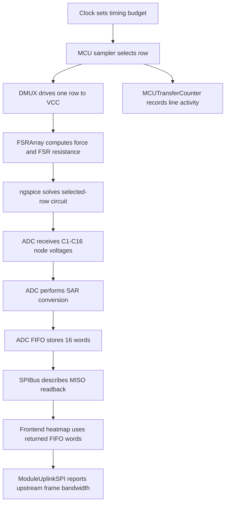

# FSR Hardware Model Classes

This document explains the structure of `backend/fsr/hardware.py`. The file models the hardware-facing layer of the FSR readout demo: row selection, FSR resistance, ngspice electrical solving, MAX11632 ADC behavior, SPI transactions, and data-rate accounting.

The sampler in `backend/fsr/sampler.py` acts like the MCU scan program. The classes below act like the hardware blocks that the sampler drives.

```text
FSRReadoutProgram
    -> Clock
    -> DMUX
    -> FSRArray
        -> FSR
        -> Resistor
        -> NgSpiceBackend
    -> ADC
    -> SPIBus
    -> MCUTransferCounter
    -> ModuleUplinkSPI
```

## Global Constants

| Constant | Value | Purpose |
|---|---:|---|
| `VCC` | `3.3` | Shared row-drive voltage and ADC reference voltage. |
| `ADC_BITS` | `12` | Effective MAX11632 conversion resolution. |
| `ADC_MAX_CODE` | `4095` | Maximum 12-bit ADC code. |
| `MAX11632_OUTPUT_WORD_BITS` | `16` | MISO output word width: `0000 + 12-bit code`. |
| `MODULE_FRAME_METADATA_BYTES` | `20` | Metadata added when the module MCU sends a full frame upward. |
| `MODULE_UPLINK_COMMAND_BITS` | `32` | Initial command-frame size from FPGA/hub to module MCU. |
| `MODULE_UPLINK_WORD_BITS` | `16` | Raw sample width sent from STM32G474 to the upper FPGA/hub. |

`MAX11632_INPUT_DATA_BYTE_TABLE` mirrors the ADC datasheet input-byte register table. It is used by the frontend to display the `Conversion`, `Setup`, `Averaging`, and `Reset` command formats.

## `Clock`

`Clock` converts the user-selected refresh rate into timing quantities used by the scan demo.

The key idea is that `refresh_hz` means full-array frames per second, not row scans per second. A `10 Hz` setting means the full `16 x 16` FSR frame is completed ten times per second.

Important fields:

| Field | Meaning |
|---|---|
| `refresh_hz` | Full `16 x 16` frame refresh rate, clamped to `1-700 Hz`. |
| `rows_per_frame` | Number of DMUX row selections per frame, currently `16`. |
| `adc_channels` | Number of ADC columns per selected row, currently `16`. |
| `adc_output_word_bits` | MISO bits per ADC channel result, currently `16`. |

Important properties:

| Property | Meaning |
|---|---|
| `frame_period_ms` | Time for one complete `16 x 16` frame. |
| `row_period_ms` | Time budget for one selected row. |
| `spi_bits_per_row` | `8-bit` command plus `16 x 16-bit` FIFO words, currently `264 bits`. |
| `spi_clock_hz` | Minimum SCK needed to transmit those bits inside one row period. |

`snapshot()` returns a frontend-friendly timing object with three row phases:

| Phase | Active lines | Meaning |
|---|---|---|
| `command` | `CS`, `MOSI`, `SCK` | MCU selects the MAX11632 and sends an input byte. |
| `conversion` | `EOC` | ADC samples, performs SAR conversion, fills FIFO, then pulls EOC low. |
| `read_fifo` | `CS`, `MISO`, `SCK` | MCU clocks conversion words out through MISO. |

## `MCUTransferCounter`

`MCUTransferCounter` counts how much activity the MCU produces on internal ADC-facing lines while scanning one full FSR frame.

It does not simulate analog voltages. It records protocol events:

| Line | Counted unit | Meaning |
|---|---|---|
| `Address` | bit | Four row-address bits written to A1-A4 per row. |
| `SCK` | pulse | SPI clocks for the ADC command and FIFO readback. |
| `MOSI` | bit | MAX11632 command bits transmitted by MCU. |
| `MISO` | bit | FIFO result bits received from ADC. |
| `CS` | assertion and edge | ADC chip-select windows and transitions. |

`record_row()` adds one row scan to the counter. `snapshot(refresh_hz)` converts per-frame counts into per-second rates. This is why the right-side data-rate panel is based on MCU event counts rather than guessed formulas.

## `ModuleUplinkSPI`

`ModuleUplinkSPI` models the higher-level SPI link between one STM32G474 module MCU and the upper FPGA or hub.

This is separate from the MAX11632 ADC SPI bus. It represents the module-to-system communication layer.

Responsibilities:

| Method or property | Meaning |
|---|---|
| `samples_per_frame` | Number of FSR samples in one full frame, currently `16 x 16 = 256`. |
| `payload_bits_per_frame` | Raw sample payload bits, currently `256 x 16`. |
| `metadata_bits_per_frame` | Frame metadata bits. |
| `miso_bits_per_frame` | Module MCU result payload sent upward. |
| `sck_pulses_per_frame` | Upper-link clock pulses required for command and readback. |
| `snapshot(refresh_hz)` | Full description of upstream command, result encoding, line rates, and transactions. |

Current simulated upstream behavior:

```text
FPGA/Hub -> STM32G474:
    START_RAW_SCAN command

STM32G474 -> FPGA/Hub:
    metadata + 256 raw 16-bit ADC samples
```

This class is the natural place to extend the simulator later for event-driven output, compressed frames, VAE-encoded features, or FPGA packetization.

## `Resistor`

`Resistor` is a tiny frozen data class:

```python
@dataclass(frozen=True)
class Resistor:
    ohms: float
```

It currently represents each column load resistor, normally `10 kOhm` to ground.

## `FSR`

`FSR` maps pressure into resistance.

Important fields:

| Field | Meaning |
|---|---|
| `min_ohms` | Lowest simulated FSR resistance at high force, default `3500 ohm`. |
| `max_ohms` | Highest simulated FSR resistance at no force, default `180000 ohm`. |

`resistance(force_percent)` clamps force into `0-100%` and returns a nonlinear resistance:

```text
Rfsr = max_ohms * (1 - force)^2 + min_ohms
```

This is a behavioral approximation. It gives a smooth resistance change for the simulator before detailed calibration data is available.

## `DMUX`

`DMUX` models the 16-output row driver controlled by four address lines `A1-A4`.

State:

| Field | Meaning |
|---|---|
| `outputs` | Number of row outputs, currently `16`. |
| `vcc` | Selected-row voltage, normally `3.3 V`. |
| `address` | Zero-based selected output index. |

Main methods and properties:

| Method or property | Meaning |
|---|---|
| `set_address_bits(bits)` | Converts up to four address bits into a selected row. |
| `set_selected_row(row)` | Selects a row using one-based row numbering. |
| `selected_row` | Returns the active one-based row. |
| `address_bits` | Returns A1-A4 levels for the current row. |
| `row_voltage(row)` | Returns `VCC` for the selected row and `0 V` for all others. |
| `row_states()` | Returns all rows with selected state, voltage, and diode marker for rendering. |

Hardware interpretation:

```text
A1-A4 select one row.
Selected row = VCC.
All other rows = GND.
Each row is displayed with a diode marker to represent backflow protection.
```

## `ADC`

`ADC` is the MAX11632/MAX11633-style behavioral model. It handles digital command decoding, SAR conversion, FIFO storage, EOC state, and MISO output words.

State:

| Field | Meaning |
|---|---|
| `channels` | Number of analog inputs, currently `16`. |
| `bits` | Conversion resolution, currently `12`. |
| `vref` | ADC reference voltage, currently `3.3 V`. |
| `max_code` | Maximum code for the selected bit depth. |
| `fifo` | List of converted channel words waiting for readback. |
| `eoc` | End-of-conversion signal. `0` means conversion complete. |

Command helpers:

| Method | Purpose |
|---|---|
| `input_data_byte_table()` | Returns the datasheet-like input byte table for frontend display. |
| `describe_input_byte(value)` | Decodes any 8-bit MOSI byte into register type and fields. |
| `setup_command()` | Builds a setup-register byte. |
| `averaging_command()` | Builds an averaging-register byte. |
| `reset_command()` | Builds a reset-register byte. |
| `scan_command()` | Builds a conversion-register byte. |
| `scan_mode_label()` | Human-readable explanation of the scan mode. |

Conversion helpers:

| Method | Purpose |
|---|---|
| `encode(voltage)` | Converts a voltage into a clamped 12-bit code. |
| `sar_convert(channel, voltage)` | Performs behavioral SAR conversion for one channel. |
| `channels_for_command(command, nscan)` | Determines which ADC channels a command will scan. |
| `start_scan(voltages, command, nscan)` | Converts selected channels, fills FIFO, and pulls EOC low. |
| `read_fifo()` | Returns a copy of the FIFO contents. |

The MISO output format is:

```text
16-bit word = 0000 + 12-bit ADC code
```

The ADC does not know where voltages came from. It simply converts the `C1-C16` node voltages passed in by `FSRArray`.

## `SPIBus`

`SPIBus` describes the four-wire SPI interface between the STM32G474 module MCU and the MAX11632 ADC.

Lines:

| Line | Direction | Carries |
|---|---|---|
| `SCK` | MCU -> ADC | Serial clock pulses. |
| `MOSI` | MCU -> ADC | MAX11632 setup, conversion, averaging, or reset bytes. |
| `MISO` | ADC -> MCU | FIFO output words. |
| `CS` | MCU -> ADC | Active-low ADC chip select. |

`frame(row, command, words, clock)` returns a structured description of one row-level SPI frame:

1. `command`: MCU asserts CS and sends the 8-bit conversion command on MOSI.
2. `conversion`: ADC samples, converts, fills FIFO, and pulls EOC low.
3. `read_fifo`: MCU asserts CS again and clocks out FIFO words on MISO.

The frontend uses this object to display current line states, command bytes, FIFO words, and protocol notes.

## `FSRArray`

`FSRArray` is the electrical model of the selected FSR row and its 16 column voltage dividers.

State:

| Field | Meaning |
|---|---|
| `rows` | Number of FSR rows, currently `16`. |
| `cols` | Number of FSR columns, currently `16`. |
| `vcc` | Row drive voltage, normally `3.3 V`. |
| `load` | Column pull-down/load resistor, normally `10 kOhm`. |
| `fsr` | Shared FSR resistance model. |
| `use_ngspice` | Enables ngspice electrical solving when available. |
| `mux_on_ohms` | Simulated selected-path MUX on-resistance, default `70 ohm`. |
| `last_solver` | Records whether the latest row used `ngspice` or Python fallback. |
| `last_solver_detail` | Human-readable solver description. |

Important methods:

| Method | Purpose |
|---|---|
| `force_at(...)` | Computes local force at one FSR cell from object position, size, and mass. |
| `divider_voltage(row_voltage, fsr_ohms)` | Closed-form ideal divider fallback. |
| `solve_row_voltages(row_voltage, fsr_values)` | Uses ngspice if available; otherwise uses the fallback divider equation. |
| `read_row(...)` | Returns all 16 column readings for the selected DMUX row. |

Current selected-row circuit solved by ngspice:

```text
Vrow
 |
Rmux
 |
rowline
 |---- Rfsr1 ---- C1 ---- Rload1 ---- GND
 |---- Rfsr2 ---- C2 ---- Rload2 ---- GND
 ...
 |---- Rfsr16 --- C16 --- Rload16 --- GND
```

`read_row()` returns one dictionary per column:

| Key | Meaning |
|---|---|
| `row` | Selected row number. |
| `col` | Column number. |
| `force` | Local force percentage. |
| `fsrOhms` | FSR resistance after force mapping. |
| `loadOhms` | Column load resistor value. |
| `muxOnOhms` | Selected-path MUX on-resistance used by ngspice. |
| `nodeVoltage` | ADC input voltage for the column. |
| `active` | Whether local force is nonzero. |
| `solver` | `ngspice` or `python`. |

The ADC then converts `nodeVoltage` into codes and FIFO words. This keeps the data path hardware-like:

```text
Object pressure
  -> FSR resistance
  -> ngspice row-voltage solve
  -> ADC SAR conversion
  -> FIFO
  -> MISO
  -> heatmap update
```

## Class Interaction During One Row Scan



## What This File Does Not Do

`backend/fsr/hardware.py` does not implement the high-level scan loop. That lives in `backend/fsr/sampler.py`.

It also does not render the frontend. It only returns structured hardware state that the frontend can draw.

It does not yet model every analog effect in the real board. For example, diode forward drops, leakage, parasitic capacitance, ADC acquisition-time error, and noise are still simplified or omitted. The ngspice hook is now in place so those effects can be added incrementally.
