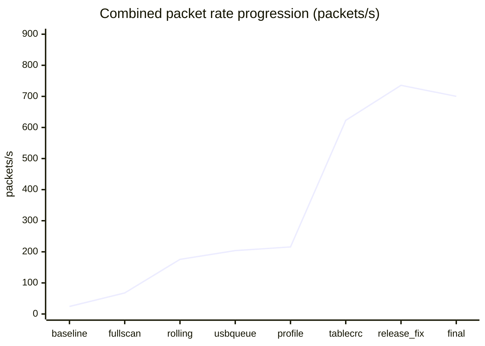

# Update: stable 700 Hz combined transport / 稳定 700 Hz 组合传输

Date: 2026-08-10

## Result / 结果

The combined STM32G474 + Teensy 4.1 system now transports complete 1188-byte
CRC32-protected packets at a measured **700.181 packets/s for 60 seconds**.
All 41,331 diagnostic-window transactions were accepted; CRC, magic, header,
USB-short, and NSS-release error deltas were all zero.

组合系统现已连续 60 秒稳定输出 **700.181 个完整数据包/s**。诊断窗口内
41,331 次传输全部通过，CRC、帧头、长度、USB 短写和 NSS 释放错误均为 0。

> Important: 700 Hz is the packet/transport rate, not the fresh sampling rate
> of every physical sensor cell. Each packet updates one shared FSR MUX address
> and carries the retained full matrices. A complete 16-address FSR refresh is
> **43.76 Hz**; the nine ACC XYZ records refresh at **100 Hz**.
>
> 重要：700 Hz 指完整数据包传输率，不代表每个 FSR 点都以 700 Hz 重新采样。
> 每包更新一个 MUX 地址，16 包完成一次全矩阵刷新，因此完整 FSR 刷新率是
> **43.76 Hz**；9 个加速度计数据以 **100 Hz** 更新。

## Final data flow / 最终流程


## Final configuration / 最终配置

| Component | Setting |
|---|---:|
| STM32 SYSCLK/HCLK | 80 MHz |
| STM32 APB1/APB2 | 80 / 80 MHz |
| ADC SPI1 / ACC SPI2 | 10 / 10 MHz |
| Teensy CPU build | 600 MHz default (`F_CPU=600000000`) |
| Host SPI SCK | 10 MHz hardware LPSPI, Mode 0 |
| Host pacing | 700/s; integer period 1428 us |
| IRQ settle / CS setup / CS hold | 50 / 10 / 10 us |
| STM32 NSS-high stability guard | 50 us |
| STM32 transport | full-duplex DMA, ping-pong frames |
| USB buffering | 16 complete frames |
| Build type | Release |

## Attempt record / 尝试记录

| # | Evidence label | Change and result |
|---:|---|---|
| 1 | `20260810_202744_700hz_attempt1_hw10_fullscan` | 10 MHz hardware Host SPI, all 16 MUX addresses per packet: 67.6/s, CRC 0. Acquisition was the limit. |
| 2 | `20260810_203240_700hz_attempt2_hw10_rolling1` | One MUX address per packet: 175.7/s, CRC 0. Synchronous USB became limiting. |
| 3 | `20260810_203450_700hz_attempt3_hw10_rolling1_usbqueue16` | Added 16-frame USB queue: 203.9/s, CRC 0, but 100 queue drops. |
| 4 | `20260810_203826_700hz_attempt4_profile_hw10_rolling1` | Profiling: 215.667/s; bitwise CRC made pack/CRC about 4654 us, the dominant cost. |
| 5 | `20260810_204200_700hz_attempt5_tablecrc_hw10_rolling1_queue16` | Table CRC: 622.833/s, CRC 0; Debug pack/CRC about 1234 us. |
| 6 | `20260810_204433_700hz_attempt6_release_hw10_rolling1_queue16` | Release exposed an NSS race: alternating DMA timeout/stale prefix, only 0.667/s. |
| 7 | `20260810_204633_700hz_attempt7_release_hw10_timing50_10_10` | Increased Teensy timing only: still 0.5/s, proving CS setup/hold was not the cause. |
| 8 | `20260810_204934_700hz_attempt8_release_nsshigh50_hw10` | NSS high/stable 50 us before rearm fixed the race: producer 883.333/s, delivered 735.667/s, errors 0, but 508 USB queue drops. |
| 9 | `20260810_205057_700hz_attempt9_release_hw10_paced700_queue16` | Paced producer to 700/s. Raw intervals were stable; requested-duration rate calculation was misleading at startup. |
| 10 | `20260810_205259_700hz_attempt10_steady_hw10_release_paced700` | Rate calculation used Teensy `millis()`: 700.133/s for 10 s, 100% accepted, zero errors/gaps. |
| final | `20260810_205339_700hz_final_release_hw10_paced700_60s` | 60-second acceptance: 700.181/s, 100% accepted, every transport error delta 0. |



The final controlled rate is 28.97x the previous accepted 24.167/s point.
The unpaced 883/s result demonstrates margin; pacing trades excess producer
rate for zero sustained USB queue loss.

## Final 60-second acceptance / 最终验收

Evidence: `docs/test_results/20260810_205339_700hz_final_release_hw10_paced700_60s.txt`
and its matching `.bin` raw capture.

| Metric | Result |
|---|---:|
| Raw bytes | 49,928,572 |
| Diagnostic interval | 59.029 s |
| IRQ / completed delta | 41,331 / 41,331 |
| Transfer and USB output rate | 700.181/s |
| Acceptance / USB ready | 100% / 100% |
| CRC / magic / header errors | 0 / 0 / 0 |
| USB short / NSS release timeout | 0 / 0 |
| Independently parsed valid frames | 42,011 |
| Sequence span / gaps | 181087..223097 / 0 |
| Rolling flags / MUX addresses | `0x0F` / all 0..15 |

| On-board profiled stage | Median | p95 | Maximum |
|---|---:|---:|---:|
| FSR acquisition | 393 us | 395 us | 396 us |
| ACC work | 1 us | 268 us | 304 us |
| Pack + CRC32 | 486 us | 487 us | 487 us |
| DMA wait | 452 us | 453 us | 1447 us |

## What fixed the failures / 为什么能够成功

1. Rolling acquisition removed the need to scan all 16 MUX addresses inside
   every 1.428 ms transport period.
2. A USB ring buffer decoupled SPI reception from PC USB availability.
3. Table-driven CRC32 removed several milliseconds of CPU work per packet.
4. Release optimisation reduced packing cost but revealed a chip-select race;
   waiting for NSS high and stable for 50 us fixed it.
5. Explicit 700/s pacing kept the producer inside sustained USB capacity.
6. Diagnostic rates now use the actual Teensy interval, avoiding startup error.

## Known limitation and next path / 已知限制与后续方向

- The earlier FSR1 observation (raw values staying near 0/1) is a separate
  analogue/hardware issue and is not hidden by this transport pass. FSR2 had
  normal source values. This validates transport integrity, not FSR1 quality.
- Reaching 700 **complete fresh 16x16 FSR scans/s** needs 16 times the current
  rolling acquisition throughput and a different acquisition architecture:
  parallel conversion/readout, additional ADC/SPI channels, a shorter verified
  analogue settle time, or a reduced matrix/sample set.

## Reproduce / 复现

```powershell
& "D:\study\programming\ESKIN\firmware\tools\commands\flash_combined_pair.cmd" COM9

powershell.exe -NoProfile -ExecutionPolicy Bypass -File `
  "D:\study\programming\ESKIN\firmware\tools\capture_combined_diagnostics.ps1" `
  -Port COM9 -DurationSeconds 60 -Label 700hz_validation
```
