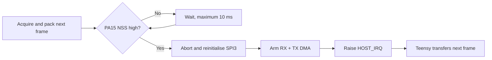
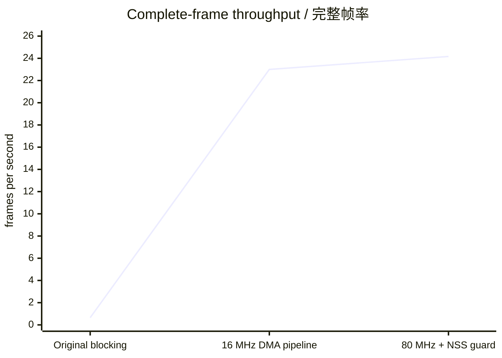

# E-SKIN Progress Update 4 — STM32 80 MHz validation

**Date:** 10 August 2026
**Status:** Hardware accepted / 实机验收通过

> 中文概览：STM32 combined-system 固件已由 16 MHz 提升到 80 MHz，并完成
> 编译、烧录和 60 秒实机测试。升频最初暴露了一个 CS/NSS 时序竞争；加入 NSS
> 释放保护后，CRC、协议、DMA 和 USB-ready 错误均为 0。当前稳定传输率为
> 24.167 完整帧/秒，下一瓶颈是 250 kHz Host SPI，而不是 STM32 CPU。

This report follows the DMA and ping-pong-buffer performance update. It records
the 80 MHz clock change, the timing fault exposed by the faster CPU, its final
fix, and the hardware acceptance evidence.

## 1. Accepted configuration / 最终配置

| Clock or interface | Accepted value | Derivation or source |
|---|---:|---|
| STM32 SYSCLK/HCLK | **80 MHz** | HSI 16 MHz / PLLM 4 × PLLN 40 / PLLR 2 |
| APB1 | **20 MHz** | HCLK / 4 |
| APB2 | **80 MHz** | HCLK / 1 |
| ADC SPI1 | **5 MHz** | APB2 80 MHz / 16 |
| ACC SPI2 | **312.5 kHz** | APB1 20 MHz / 64 |
| Host SPI3 SCK | nominal **250 kHz** | External Teensy software Mode-0 clock |
| MUX settling time | **100 us** | DWT delay scaled by `SystemCoreClock` |
| Host transfer | full-duplex DMA | 1188-byte `ESK1` frame, RX + TX |
| Frame buffering | two buffers | acquisition/transfer ping-pong pipeline |

The clock setup uses voltage scale 1 and two Flash wait states. SPI3 is a slave,
so its wire clock is supplied by Teensy and remains nominal 250 kHz regardless
of the STM32 APB1 clock.

## 2. What failed after raising the clock / 升频后出现的问题

At 16 MHz, acquisition was slow enough that Teensy had normally released CS
before STM32 prepared the next transaction. At 80 MHz, STM32 could finish the
next acquisition while Teensy was still inside its 100 us CS hold period.

The old sequence could therefore become:

Observed symptoms were alternating successful and incomplete transactions,
stale prefix bytes, DMA release timeouts, approximately 50% CRC failures, and
only about 0.6 transactions/s.

## 3. Diagnostic attempts / 排查过程

| Attempt | Result | Conclusion |
|---|---|---|
| Initial 80 MHz, APB1 80 MHz | About 50% CRC failure | 80 MHz exposed a new timing problem |
| Reduce APB1 to 20 MHz | Failure pattern unchanged | APB1/SPI3 internal peripheral clock was not the root cause |
| Replace `__WFI()` with polling | Failure pattern unchanged | CPU sleep/wakeup was not the root cause |
| Wait for PA15 NSS high before SPI3 reset/re-arm | CRC and timeout errors became zero | Confirmed a CS/NSS release race |

Evidence files:

- `docs/test_results/20260810_193427_stm32_80mhz_soft250_dma_pingpong.txt`
- `docs/test_results/20260810_193839_stm32_80mhz_apb1_20mhz_soft250_dma_pingpong.txt`
- `docs/test_results/20260810_194316_stm32_80mhz_apb1_20mhz_dma_poll_soft250.txt`
- `docs/test_results/20260810_195415_stm32_80mhz_nss_release_guard_soft250_60s.txt`

## 4. Final fix / 最终修复

Before aborting, reinitialising and re-arming SPI3 DMA, STM32 now waits for the
hardware NSS input on PA15 to return high. A 10 ms diagnostic timeout prevents
an indefinitely stuck-low CS from blocking the acquisition loop and increments
`host_dma_timeout_count` if it occurs.

This preserves `__WFI()` in the DMA completion wait because the polling test
showed that WFI was not responsible for the failures.

## 5. 60-second hardware acceptance / 60 秒实机验收

Test record:
`docs/test_results/20260810_195415_stm32_80mhz_nss_release_guard_soft250_60s.txt`

| Measurement | Result |
|---|---:|
| STM32 IRQ count | 1450 |
| Completed/accepted frames | 1438 |
| CRC errors | **0** |
| Magic errors | **0** |
| Header errors | **0** |
| Post-settle USB short writes | **0** |
| NSS release timeouts | **0** |
| USB-ready acceptance | **1438/1438 = 100%** |
| Transaction rate | **24.167 frames/s** |
| Effective USB output | **23.967 frames/s** |

Independent parsing found one sequence gap where the capture window crossed
the USB/startup boundary. After that boundary, sequences 3756 through 5182 form
**1427 consecutive CRC-valid frames with zero steady-state gaps**, exceeding
the required 1000-frame acceptance gate.

## 6. Performance comparison / 性能对比

| Configuration | Transaction rate | USB output | CRC errors |
|---|---:|---:|---:|
| 16 MHz accepted baseline | 23.0 frames/s | 22.4 frames/s | 0 |
| 80 MHz + NSS guard | **24.167 frames/s** | **23.967 frames/s** | **0** |

- Transaction-rate improvement: approximately **5.1%**.
- USB-output improvement: approximately **7.0%**.
- Total improvement from the original 0.65 fps blocking path: approximately
  **37.2×**.

The CPU clock increased by 5×, but complete-frame throughput increased by only
5.1%. One 1188-byte frame needs about 38.0 ms of wire time at nominal 250 kHz,
which gives a theoretical wire-only ceiling of about 26.3 frames/s. The measured
41.4 ms cycle is already close to that limit. The principal bottleneck has
therefore moved from STM32 processing to the Host SPI link.

## 7. Next optimisation / 下一步

1. Keep the accepted STM32 80 MHz and NSS-release guard unchanged.
2. Validate sensor raw-data quality under controlled FSR pressure and ACC motion.
3. Increase Host SPI in small verified steps while requiring zero CRC, protocol,
   sequence, DMA and post-settle USB errors.
4. Consider faster sensor acquisition only after timing each stage separately.
5. Consider 170 MHz only if faster Host SPI proves that CPU processing again
   becomes the limiting stage.

## 8. Acceptance conclusion / 验收结论

The 80 MHz firmware has been built, flashed and accepted on the physical module.
The CS/NSS timing defect exposed by the faster CPU is fixed. The accepted system
state is **80 MHz STM32 + nominal 250 kHz software Host SPI + SPI3 full-duplex
DMA + ping-pong buffers + NSS-release guard**.
