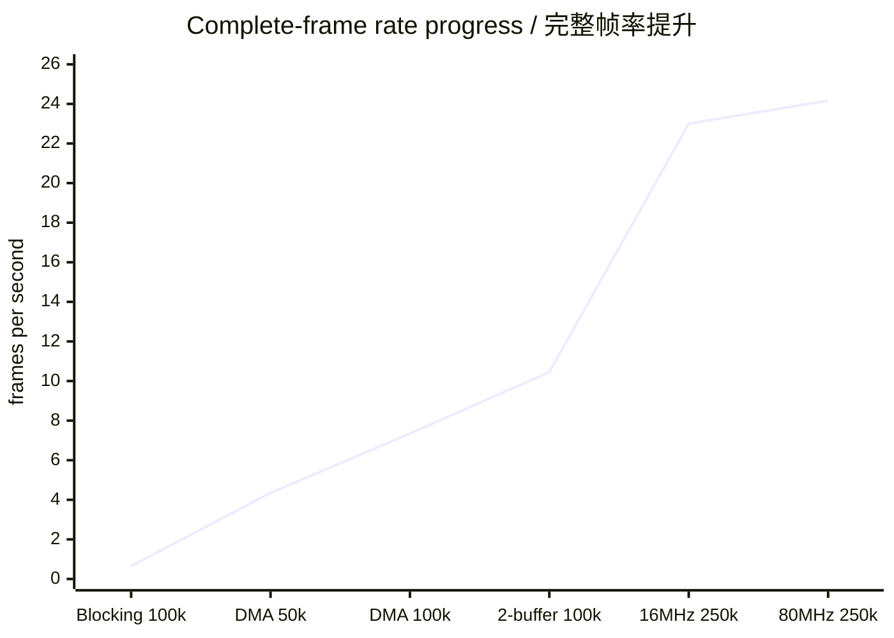
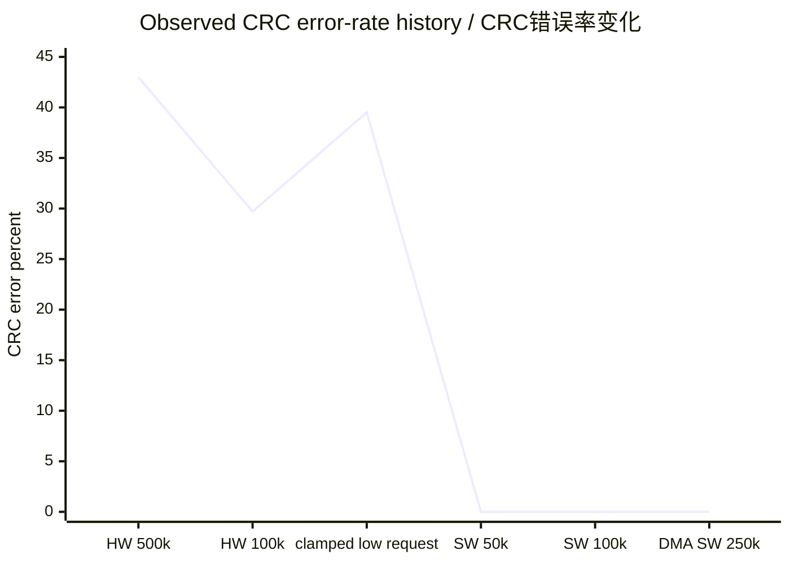

# E-SKIN Progress Update — 10 August 2026

> 中文概览：本轮工作的重点是提高完整模块的实时传输速度。通过 STM32
> SPI3 全双工 DMA、双缓冲流水线和 Teensy USB 启动保护，完整 `ESK1`
> 帧率由最初的 **0.65 fps 提升到 24.167 fps（约 37.2 倍）**。最终 60 秒测试中
> CRC 错误、稳态序列丢帧和 USB 短写均为 0。

This update follows the 5 August integration report. It records the measured
performance work completed since then and defines the next optimisation flow.

## 1. Result at a glance / 当前结果

| Item | Current accepted result |
|---|---|
| Complete frame | `ESK1`, 1188 bytes |
| Sensor payload | FSR1 512 B + FSR2 512 B + nine ACC records 144 B |
| Integrity | IEEE CRC32 over the first 1184 bytes |
| Host SPI | nominal 250 kHz software Mode-0 |
| STM32 transfer | SPI3 full-duplex DMA, RX + TX |
| Buffering | two 1188-byte ping-pong frame buffers |
| Stable transaction rate | **24.167 complete frames/s** |
| Effective USB rate over full test | **23.967 frames/s** |
| USB-ready acceptance | **1438/1438 = 100%** |
| CRC errors | **0** |
| Parsed steady-state sequence gaps | **0 across 1427 consecutive frames** |

The 23.967 fps USB figure includes the deliberate 500 ms USB connection-settling
period. Once USB was ready, every eligible frame was forwarded.

## 2. What changed since the previous update / 主要改动

| Before | Change | Effect |
|---|---|---|
| Blocking STM32 Host-SPI completion | SPI3 RX/TX full-duplex DMA | Removed the 1500 ms blocking timeout from the normal frame path |
| One frame buffer | Two software ping-pong buffers | Acquisition/packing of frame N+1 overlaps transmission of frame N |
| Immediate USB forwarding after connect | 500 ms USB settling period | Avoids startup-only USB short writes |
| Uncontrolled low-rate hardware-SPI requests | Deterministic software Mode-0 clock on Teensy | Makes 50/100/250 kHz comparison repeatable |
| General pass/fail observation | Counters plus raw frame parsing | Separates CRC, sequence, DMA, protocol and USB failures |

> 中文说明：DMA 负责在后台搬运 SPI 数据，CPU 同时采集下一帧；双缓冲让
> “采集”和“传输”重叠进行。因此提升并不只是提高时钟，而是消除了等待时间。

## 3. Measured performance progression / 实测进步

All rates below refer to complete 1188-byte frames, not individual ADC samples.

| Stage | Host clock | Complete frames/s | Valid payload rate | CRC result |
|---|---:|---:|---:|---:|
| Blocking completion | 100 kHz | 0.65 | 0.77 kB/s | 13/13 valid |
| Full-duplex DMA | 50 kHz | 4.35 | 5.17 kB/s | 87/87 valid |
| Full-duplex DMA | 100 kHz | 7.35 | 8.73 kB/s | 147/147 valid |
| DMA + ping-pong | 100 kHz | 10.45 | 12.41 kB/s | 209/209 valid |
| DMA + ping-pong, 16 MHz baseline | 250 kHz | **23.0** | **27.32 kB/s** | **448/448 valid** |
| DMA + ping-pong, 80 MHz + NSS guard | 250 kHz | **24.167** | **28.71 kB/s** | **1438/1438 USB-ready valid** |



The final rate is approximately **37.2 times** the original blocking result.
At 250 kHz, one frame occupies about 38.0 ms of nominal wire time, giving a
wire-only ceiling of approximately 26.3 fps. The measured pipeline cycle is
about 43.5 ms. Sensor acquisition and packing are therefore now slightly slower
than the Host-SPI wire transfer and are the next bottleneck.

## 4. Historical CRC-failure attempts / CRC 未通过的历史尝试

> 这一页保留失败实验是为了说明问题如何被定位。下表中的硬件 SPI 失败结果
> 来自旧的阻塞式 STM32 传输路径，不能代表当前“软件 SPI + 全双工 DMA +
> 双缓冲”的最终配置。

### 4.1 Failure record

| Attempt | Observed result | Decision at that time |
|---|---|---|
| 5 August, initial long-frame transfer | Correct `ESK1` header, but every complete frame failed CRC | Inspect byte alignment rather than changing sensor acquisition |
| Hardware LPSPI, requested 500 kHz, pre-DMA | About 49 frames accepted and 37 CRC failures in the measured window; approximately **43.0% CRC errors** | Reject 500 kHz and test lower clocks |
| Hardware LPSPI, requested 250 kHz, pre-DMA | Initially accepted frames, followed by continuous CRC failures and roughly one transaction/s | Reject and restore the 100 kHz fallback |
| Hardware LPSPI, requested 100 kHz, pre-DMA | About 97 accepted and 41 CRC failures; approximately **29.7% CRC errors** | Clock frequency alone was not the complete cause |
| Hardware LPSPI, requested 50 kHz | 219 accepted and 143 CRC failures out of 362; **39.503% CRC errors** | Invalid frequency comparison: 18.1 transactions/s is physically impossible for a true 50 kHz, 1188-byte transfer |
| Controlled software Mode-0, true nominal 50 kHz | 85/85 accepted, CRC errors = 0 | Proved that a controlled low-rate clock could transfer the frame cleanly |
| Controlled software Mode-0, nominal 100 kHz, blocking STM32 | 13/13 CRC-valid, but only 0.65 fps due to the 1500 ms HAL timeout | CRC pass, complete-system performance fail |
| Software Mode-0 + DMA + ping-pong, nominal 250 kHz | 448/448 USB-ready frames accepted, CRC errors = 0 | Current accepted configuration |

The chart below is chronological debugging evidence, not a pure frequency
sweep: firmware and transfer method changed between stages.



### 4.2 First root cause: two stale prefix bytes

The early receive buffers repeatedly began as follows:

```text
92 BC | 45 53 4B 31 ...
26 2D | 45 53 4B 31 ...
69 4D | 45 53 4B 31 ...
39 0F | 45 53 4B 31 ...
```

The valid `ESK1` magic was consistently at offset 2. Because Teensy clocked
exactly 1188 bytes, the buffer contained two stale prefix bytes but omitted the
last two CRC bytes. CRC validation therefore could not pass.

The paired correction was:

- STM32 aborts and reinitialises SPI3 before asserting HOST_IRQ, clearing stale
  TX/RX/FIFO state;
- Teensy keeps CS low, searches the first clocks for `ESK1`, discards a detected
  prefix and continues until a complete 1188-byte logical frame is collected;
- `#ESKALIGN`, `#ESKCRC` and related counters expose alignment and CRC failures.

> 中文：这次失败不是 CRC32 公式算错，而是接收的数据前面多了两个旧字节，
> 导致帧尾两个 CRC 字节没有被接收。

### 4.3 Why the requested 50 kHz result was invalid

The saved hardware-LPSPI capture reported `spi_hz=50000`, but completed 362
transactions in 20 seconds. A true 50 kHz clock needs about 190 ms for each
1188-byte frame and cannot reach 18.1 transactions/s.

Teensyduino 1.62.0 limits the Teensy 4.x LPSPI divisor to 257, so very low
requested clocks are clamped to a faster achievable hardware clock. The
39.503% CRC result is real for that capture, but it must not be presented as a
true 50 kHz electrical result.

Retained evidence:

- [`20260810_140929_host_spi_50khz.txt`](../../test_results/20260810_140929_host_spi_50khz.txt)
- `docs/test_results/20260810_140929_host_spi_50khz.bin`

### 4.4 Conclusion from the failed attempts

The failed trials established four separate facts:

1. CRC correctly rejected incomplete, shifted or corrupted frames.
2. The fixed two-byte prefix was a frame-alignment problem and was corrected.
3. Raw requested clock frequency was not the only variable: LPSPI edge shape,
   sampling instant and divider clamping also mattered.
4. Software Mode-0 removed the CRC corruption, while full-duplex DMA separately
   removed the STM32 blocking-completion timeout.

Therefore the present zero-error 250 kHz result does not contradict the earlier
250 kHz failure: they use different Host-clock generation and different STM32
transfer implementations. Any future hardware-LPSPI test must be treated as a
new validation stage.

## 5. Current complete-frame flow / 当前完整流程

```text
STM32 CPU:  scan FSR1 + scan FSR2 + read 9 ACC + pack + CRC
                 | frame N+1                         |
                 +-----------------------------------+

STM32 DMA:       SPI3 RX dummy drain + SPI3 TX frame N
                                      |
Teensy:        IRQ -> CS -> 1188-byte Mode-0 transfer -> CRC check
                                      |
PC:                        USB CDC -> parser -> GUI / capture
```

The active STM32 DMA mapping is:

- DMA1 Channel 1: SPI3 RX, draining the master-generated MOSI bytes;
- DMA1 Channel 2: SPI3 TX, transmitting the complete `ESK1` frame.

Keeping RX active is required even though the application payload travels from
STM32 to Teensy: SPI is full duplex and every transmitted byte also receives a
byte.

## 6. Accepted 20-second test / 最终测试记录

```text
delta_irq=460
delta_ok=448
delta_usb_off=12      (intentional 500 ms connection settling)
delta_usb_short=0
delta_crc=0
transaction_rate=23.0 Hz
USB output rate=22.4 frame/s
USB-ready acceptance=448/448 = 100%
```

Independent raw parsing found 457 complete binary frames, sequence 9610 through
10066, with zero sequence gaps. The counter and binary windows have slightly
different endpoints because the diagnostic counters were sampled inside the
raw-capture interval; this is not frame loss.

Evidence files:

- [`20260810_152754_host_spi_250khz_soft_dma_pingpong_usb_settle.txt`](../../test_results/20260810_152754_host_spi_250khz_soft_dma_pingpong_usb_settle.txt)
- `docs/test_results/20260810_152754_host_spi_250khz_soft_dma_pingpong_usb_settle.bin`

## 7. Next optimisation workflow / 后续流程

The protocol layout and CRC algorithm remain unchanged throughout these steps.
Only one timing variable should be changed per test.

### Phase A — Measure each bottleneck

Add microsecond timing around FSR1, FSR2, nine-ACC acquisition, packing/CRC,
DMA transfer and the complete cycle. Record minimum, average and maximum time,
together with ADC EOC timeout, DMA error and protocol counters.

> 中文：先测量，再优化。否则只提高 SPI 时钟可能不会提高完整帧率。

### Phase B — Overlap the two ADC conversions

Start ADC1 and ADC2 conversion for the same MUX address before waiting for EOC.
Wait for both devices, then read their results. Their conversion periods can
then overlap instead of running completely in sequence.

Pass gate: 1000 frames with zero CRC/gaps/timeouts, plus correct coordinates for
isolated presses on both FSR arrays.

### Phase C — Reduce MUX settling time carefully

Test the current 100 us settling delay in controlled steps:

```text
100 us -> 75 us -> 50 us -> 25 us
```

CRC alone cannot validate this change because CRC only protects transport.
At every step, compare raw ADC stability, spatial position and neighbouring-cell
crosstalk under repeatable pressure.

### Phase D — Increase sensor-side SPI rates

- ACC SPI2: test 500 kHz -> 1 MHz -> 2 MHz;
- retain WHO_AM_I = `0x33` and valid data from all nine logical positions;
- only change ADC SPI1 from its present 8 MHz if MAX11633 timing limits and
  measured signal quality permit it.

### Phase E — Revalidate hardware Host SPI after DMA

Earlier high-speed hardware-SPI CRC failures occurred before the current DMA
pipeline. Re-test Teensy hardware LPSPI at:

```text
500 kHz -> 1 MHz -> 2 MHz -> 4 MHz
```

Use 1000 frames for each initial gate, then at least 10,000 frames or 60 seconds
for the selected rate. Require zero CRC errors, sequence gaps, DMA errors and
USB short writes. Teensyduino 1.62.0 clamps very low hardware-SPI divider
requests, so old “50 kHz hardware SPI” data is not a true 50 kHz comparison.

### Phase F — Increase STM32 processing clock

The combined firmware is now configured for an 80 MHz SYSCLK/HCLK using
`HSI / 4 * 40 / 2`, voltage scale 1 and two Flash wait states. Because the SPI
prescalers are powers of two, the previous 8 MHz ADC and 500 kHz ACC clocks
cannot be reproduced exactly from 80 MHz. Initial validation therefore uses
conservative clocks: SPI1 = 5 MHz and SPI2 = 312.5 kHz. DWT microsecond delays
scale from `SystemCoreClock`; HAL millisecond timing is recalculated by the HAL.

APB2 runs at 80 MHz and APB1 is divided to 20 MHz. Therefore SPI1 is
80 MHz / 16 = 5 MHz and SPI2 is 20 MHz / 64 = 312.5 kHz.

The first 80 MHz captures failed at approximately 50% CRC because acquisition
completed before Teensy released NSS after its 100 us CS hold. The next SPI3
abort/reinitialisation could therefore begin during the preceding transaction.
An NSS-high guard on PA15 removed this race; reducing APB1 and replacing WFI
with polling had already shown that neither peripheral clock nor sleep was the
root cause.

Status: **hardware accepted.** The final 60-second run recorded 1450 IRQs,
1438 completed USB-ready frames, 0 CRC/magic/header errors, 0 post-settle USB
short writes, 0 NSS-release timeouts, 24.167 transactions/s and 23.967 USB
frames/s. After one capture/startup boundary gap, 1427 consecutive frames had
zero sequence gaps. Consider 170 MHz only after sensor-quality testing and a
faster Host SPI demonstrate that more CPU clock can improve system throughput.

### Phase G — Target gates

| Target | Required complete cycle | Likely work required |
|---|---:|---|
| 25 fps | <= 40 ms | Small acquisition reduction; current result is already close |
| 50 fps | <= 20 ms | Parallel ADC work, shorter verified settling, faster Host SPI |
| 100 fps | <= 10 ms | 2–4 MHz Host SPI recommended, faster acquisition, higher STM32 clock |

At 100 fps the valid USB payload is about 118.8 kB/s. The difficult part is not
USB bandwidth, but completing acquisition, packing and Host-SPI transfer within
10 ms.

## 8. Validation checklist / 每一步的验收标准

- Transport: CRC errors = 0, invalid magic/header = 0, sequence gaps = 0.
- DMA: completion timeout = 0 and DMA error = 0.
- USB: short writes = 0 after the deliberate connection-settling interval.
- FSR: pressed coordinate responds without new neighbouring-cell ghosting.
- ACC: all nine positions remain readable and WHO_AM_I is `0x33`.
- Stability: first 1000 frames, then at least 10,000 frames or 60 seconds.
- Evidence: save raw `.bin`, parsed `.txt`, settings and date under
  `docs/test_results/`.

## 9. Known boundary / 已知边界

FSR2 is responding normally. The separate FSR1 raw-value issue remains: its
standalone stream is continuous but all 256 values are only 0 or 1. This is
recorded in [`docs/FSR_TEST_ERROR.md`](../../FSR_TEST_ERROR.md) and must not be
confused with the now-stable CRC/Host-SPI transport path.

The current 250 kHz value is the nominal software-generated clock. Exact edge
frequency and duty cycle should be confirmed with an oscilloscope or logic
analyser before using it as an electrical timing specification.

## 中文汇报摘要

- 完整帧为 1188 字节，包含两块 16 x 16 FSR、9 个 ACC 和 CRC32。
- DMA 消除了阻塞等待，双缓冲使采集和传输可以同时进行。
- 完整帧率从 0.65 fps 提高到 24.167 fps，提升约 37.2 倍。
- 最终 60 秒测试 CRC 错误为 0，且启动边界后连续 1427 帧无序列丢帧、USB 短写为 0。
- 当前瓶颈已经从单纯的 Host SPI 等待转移到传感器采集与打包阶段。
- 后续顺序：分段计时、并行双 ADC、缩短 MUX 稳定时间、提高传感器 SPI、
  重新验证硬件 Host SPI、最后提高 STM32 系统时钟。
- 目标 50 fps 需要完整周期不超过 20 ms；目标 100 fps 需要不超过 10 ms。
