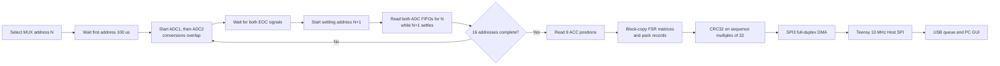
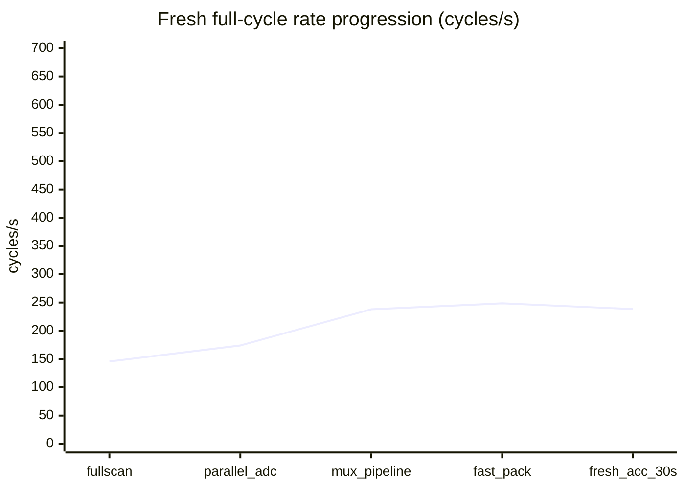

# Update: 700 Hz fresh-scan attempt / 700 Hz 全新扫描尝试

Date: 2026-08-11

## Outcome / 结果

The last stable **700.181 packets/s rolling-acquisition** version was preserved
first on branch `firmware-integration-20260810`, commit `5468ec8`. The working
tree then started a separate experiment whose acceptance target is stricter:

> Every 1.4286 ms, acquire a fresh FSR1 16x16 matrix, a fresh FSR2 16x16
> matrix, read all nine ACC positions, pack one 1188-byte frame, and send it.

当前实验不是“700 个重复携带旧矩阵的数据包/s”，而是要求每个数据包都包含刚完成的两块
16x16 FSR 扫描，并在同一帧周期读取九个 ACC 位置。

The best validated result on the present PCB is **238.475 complete cycles/s
for 30 seconds**. All 6,916 diagnostic-window transactions were accepted with
zero magic, header, sequence, sampled-CRC, USB-short, or NSS-release errors.
Every parsed frame reported 16 freshly scanned MUX addresses. This is a large
improvement, but it is **not 700 Hz**.

An independent pass over the complete binary capture decoded 7,154 valid v2
frames, rejected zero frame candidates, covered sequence 43,962..51,115 with
zero gaps, found `mux_addresses_updated=16` in every frame, and found zero bad
FSR status flags. Its own sequence/timestamp window measured 237.965/s over
30.059 s; the 238.475/s headline is the Teensy diagnostic-window rate.

| Acceptance item | Target | Current validated result |
|---|---:|---:|
| Fresh dual-FSR 16x16 scans | 700/s | 238.475/s |
| Read all nine ACC positions | every frame | every frame |
| Complete 1188-byte sends | 700/s | 238.475/s |
| Transport acceptance | 100% | 100% for 30 s |
| Sampled CRC errors | 0 | 0 / 216 checked frames |
| Sequence gaps | 0 | 0 |

## Current flow / 当前流程



## Attempt record / 尝试记录

| # | Evidence label | Main change | Complete-cycle rate |
|---:|---|---|---:|
| 1 | `20260811_085017_fullscan_v2_crc32_periodic32_attempt1` | Full 16-address scan; protocol v2; CRC every 32 frames | 145.725/s |
| 2 | `20260811_085401_fullscan_v2_crc32_parallel_adc_attempt2` | Start ADC1 and ADC2 before waiting, so conversion phases overlap | 174.009/s |
| 3 | `20260811_085745_fullscan_v2_crc32_mux_pipeline_attempt3` | Settle address N+1 while reading the two result FIFOs for N | 237.991/s |
| 4 | `20260811_090144_fullscan_v2_crc32_fastpack_attempt4` | Replace 512 element-wise pack calls with two matrix block copies | 248.577/s* |
| 5 | `20260811_090451_fullscan_v2_crc32_fresh_acc_attempt5` | Set ACC ODR to 1.344 kHz and read all positions every frame | 238.014/s |
| final | `20260811_090746_fullscan_v2_crc32_fresh_acc_attempt5_30s` | 30-second validation of attempt 5 | **238.475/s** |

\* Attempt 4 was faster because ACC data was still refreshed on the earlier
100 Hz schedule. It is not the accepted result for the strict fresh-read goal.



The accepted strict rate improved from 145.725/s to 238.475/s, a **63.64%**
increase. It currently reaches **34.07%** of the 700/s target.

## Timing evidence / 分段耗时

The final frame embeds the previous cycle's stage timings in ACC reserved
fields. Values below come from 2,384 independently parsed frames in the
10-second attempt-5 capture.

| STM32 stage | Median | Mean | Maximum |
|---|---:|---:|---:|
| Complete dual-FSR scan | 3,721 us | 3,721.3 us | 3,728 us |
| Nine-position ACC read | 267 us | 268.5 us | 303 us |
| Pack | 106 us | 106.0 us | 106 us |
| CRC stage | 0 us | 6.0 us | 193 us |
| DMA wait after overlapped work | 0 us | 0.0 us | 1 us |

The dominant remaining cost is the dual-ADC acquisition path, not Host SPI,
USB, CRC, or DMA waiting.

## Periodic CRC experiment / 定期 CRC 实验

Protocol v2 uses flag bit `0x10` to state whether the final four bytes contain
an IEEE CRC32. A frame whose sequence is divisible by 32 carries and checks a
CRC; the other 31 frames carry a zero trailer. Protocol v1 remains accepted by
the new Teensy and Python parser and always requires CRC.

The Teensy checks magic, version, length, CRC cadence, zero trailer, and
sequence continuity. The GUI says `CRC NOT PRESENT / UNVERIFIED` on an
unchecked frame instead of incorrectly displaying `CRC OK`. Diagnostics count
checked and skipped frames separately.

| 30-second CRC metric | Result |
|---|---:|
| Checked frames | 216 |
| Skipped frames | 6,700 |
| Coverage | 3.123% |
| Errors among checked frames | 0 |
| CRC time on a checked frame | about 193 us |
| Average CRC time at 1/32 cadence | about 6 us/frame |

Important limitation: a correct CRC on frame 32 does not validate frames
1..31. Payload corruption in an unchecked frame can pass through. This v2
format is an experiment and old v1-only receivers are not compatible with it.
For a production design, use STM32 hardware CRC and restore protection on
every frame.

中文说明：每 32 帧检查一次 CRC 只能减少计算量，不能用第 32 帧证明前 31 帧正确。
“CRC 错误为 0”仅表示本次被抽检的 216 帧均正确，不代表未抽检帧也经过 CRC 验证。

## Why the present PCB cannot reach 700 fresh scans/s

The target allows only:

```text
1,000,000 us / (700 frames/s * 16 MUX addresses) = 89.29 us/address
```

Each MAX11633 must produce `16 * 16 * 700 = 179.2 ksps`. The part can reach
300 ksps only in externally clocked mode. In that mode automatic scanning is
disabled and each result consumes 16 SCLK cycles. At the 4.8 MHz maximum,
one ADC needs about 53.3 us for 16 inputs. The current two ADCs share one
serial data path, so their ideal serialized minimum is about 106.7 us per MUX
address, already over the 89.29 us budget before MUX settling, ACC work,
packing, and software overhead.

This conclusion follows the official
[MAX11633 product specification](https://www.analog.com/en/products/max11633.html)
and [MAX11626-MAX11633 data sheet](https://www.analog.com/media/en/technical-documentation/data-sheets/max11626-max11633.pdf).

## Minimum path to a real 700 Hz design / 达到 700 Hz 的最小方向

1. Give ADC1 and ADC2 independent synchronous readout paths so both 16-input
   conversion streams run concurrently; the present shared DOUT path is the
   hard limit.
2. Use externally clocked conversions at a verified clock no higher than
   4.8 MHz, with DMA on both paths.
3. Validate MUX settling at approximately 25-30 us under real FSR source
   impedance and full-pressure tests; add analogue buffering if required.
4. Pipeline dual-ADC acquisition, nine-ACC reads, packing, and Host SPI rather
   than placing them serially inside one 1.4286 ms period.
5. Restore per-frame integrity using the STM32 hardware CRC peripheral.
6. Repeat a 60-second acceptance test requiring 700 fresh frames/s, zero
   sequence gaps, and zero CRC/transport errors.

中文总结：当前代码已经把可重叠的软件步骤做了并行和流水，但两颗 ADC 共用串行读出通道，
理论带宽本身不足。下一版硬件至少需要把两颗 ADC 的数字结果分开并行读取，代码才有可能真正
达到每秒 700 次完整双矩阵扫描。

## Reproduce / 复现

```powershell
& "D:\study\programming\ESKIN\firmware\tools\commands\flash_combined_pair.cmd" COM9

powershell.exe -NoProfile -ExecutionPolicy Bypass -File `
  "D:\study\programming\ESKIN\firmware\tools\capture_combined_diagnostics.ps1" `
  -Port COM9 -DurationSeconds 30 `
  -Label fullscan_v2_crc32_fresh_acc_validation
```
